# Code Source UML - Diagrammes d'Activité MoroccoCheck
## Codes PlantUML pour tous les diagrammes d'activité

*Document créé le 16 janvier 2026*

---

## Table des Matières

1. [Processus de Check-In](#1-processus-de-check-in)
2. [Processus de Calcul de Fraîcheur](#2-processus-de-calcul-de-fraîcheur)
3. [Processus de Dépôt d'Avis](#3-processus-de-dépôt-davis)
4. [Processus de Validation Professionnelle](#4-processus-de-validation-professionnelle)
5. [Processus de Modération d'Avis](#5-processus-de-modération-davis)
6. [Processus de Modération de Check-In](#6-processus-de-modération-de-check-in)
7. [Processus d'Attribution de Badge](#7-processus-dattribution-de-badge)
8. [Processus de Level-Up](#8-processus-de-level-up)
9. [Processus de Paiement Stripe](#9-processus-de-paiement-stripe)
10. [Processus de Recherche de Sites](#10-processus-de-recherche-de-sites)
11. [Processus d'Inscription](#11-processus-dinscription)
12. [Processus de Récupération de Mot de Passe](#12-processus-de-récupération-de-mot-de-passe)

---

## 1. Processus de Check-In

```plantuml
@startuml CheckInProcess

start

:Utilisateur clique "Check-in";

if (Utilisateur connecté?) then (non)
  :Rediriger vers Login;
  stop
endif

if (Rôle >= CONTRIBUTOR?) then (non)
  :Afficher message "Devenez contributeur";
  stop
endif

:Demander permission localisation;

if (Permission accordée?) then (non)
  :Afficher erreur permission;
  stop
endif

:Récupérer position GPS;

if (GPS disponible?) then (non)
  :Afficher erreur GPS;
  stop
endif

:Calculer distance avec site;

if (Distance < 100m?) then (non)
  :Afficher "Trop loin du site";
  :Afficher distance actuelle;
  stop
endif

:Vérifier cooldown (24h);

if (Check-in récent sur ce site?) then (oui)
  :Afficher "Déjà fait aujourd'hui";
  stop
endif

:Afficher formulaire check-in;

partition "Remplissage formulaire" {
  :Sélectionner statut du site;
  note right
    - Ouvert
    - Fermé temporairement
    - Fermé définitivement
    - En rénovation
    - Déménagé
  end note
  
  :Ajouter commentaire (optionnel);
  
  if (Ajouter photo?) then (oui)
    :Ouvrir caméra/galerie;
    :Sélectionner photo;
    :Compresser image;
  endif
}

:Valider formulaire;

if (Données valides?) then (non)
  :Afficher erreurs validation;
  stop
endif

fork
  :Enregistrer check-in en BD;
fork again
  :Upload photo vers S3;
end fork

:Calculer points gagnés;
note right
  Points = 10 (base)
         + 5 (si photo)
         + bonus éventuel
end note

:Mettre à jour points utilisateur;

:Mettre à jour compteur check-ins;

:Mettre à jour fraîcheur du site;

if (Nouveau badge débloqué?) then (oui)
  :Créer notification badge;
  :Afficher animation badge;
endif

if (Level-up?) then (oui)
  :Créer notification level-up;
  :Afficher animation level-up;
endif

:Afficher message succès;
:Afficher points gagnés;

stop

@enduml
```

---

## 2. Processus de Calcul de Fraîcheur

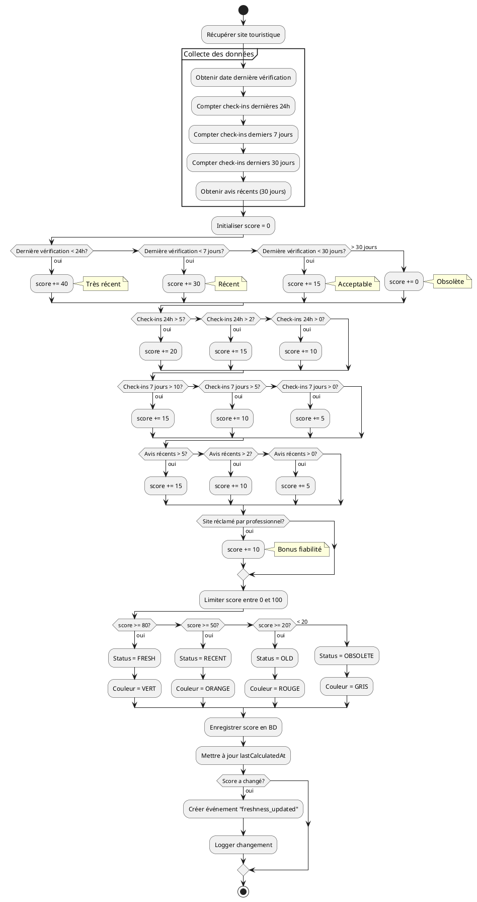

---

## 3. Processus de Dépôt d'Avis

```plantuml
@startuml ReviewSubmission

start

:Utilisateur clique "Écrire un avis";

if (Utilisateur connecté?) then (non)
  :Rediriger vers Login;
  stop
endif

:Vérifier si avis existant pour ce site;

if (Avis déjà écrit?) then (oui)
  :Afficher "Vous avez déjà donné votre avis";
  :Proposer de modifier l'avis existant;
  stop
endif

:Afficher formulaire avis;

partition "Remplissage formulaire" {
  
  :Saisir note globale (1-5 étoiles);
  note right: OBLIGATOIRE
  
  :Saisir notes détaillées (optionnel);
  note right
    - Service
    - Propreté
    - Rapport qualité/prix
    - Emplacement
  end note
  
  :Saisir titre (optionnel);
  
  :Saisir contenu avis;
  note right
    Min 20 caractères
    Max 2000 caractères
  end note
  
  :Sélectionner date de visite (optionnel);
  
  :Sélectionner type de visite;
  note right
    - Business
    - Couple
    - Famille
    - Amis
    - Solo
  end note
  
  if (Ajouter photos?) then (oui)
    repeat
      :Sélectionner photo;
      :Compresser image;
    repeat while (Plus de photos ET < 10?) is (oui)
  endif
  
  :Ajouter recommandations (optionnel);
}

:Valider formulaire;

if (Note globale présente?) then (non)
  :Erreur "Note obligatoire";
  stop
endif

if (Contenu >= 20 caractères?) then (non)
  :Erreur "Avis trop court";
  stop
endif

if (Détection spam?) then (oui)
  :Marquer pour modération;
  :Status = PENDING;
else (non)
  :Status = PUBLISHED;
endif

fork
  :Enregistrer avis en BD;
fork again
  :Upload photos vers S3;
end fork

:Calculer points gagnés;
note right
  Points = 15 (base)
         + 5 par photo (max 50)
         + 10 si avis détaillé
end note

:Mettre à jour points utilisateur;

:Mettre à jour compteur avis;

:Recalculer note moyenne du site;

:Mettre à jour fraîcheur du site;

if (Nouveau badge débloqué?) then (oui)
  :Créer notification badge;
endif

if (Status = PUBLISHED?) then (oui)
  :Créer notification propriétaire;
  :Afficher "Avis publié";
else (PENDING)
  :Afficher "En attente modération";
endif

:Afficher points gagnés;

stop

@enduml
```

---

## 4. Processus de Validation Professionnelle

```plantuml
@startuml ProfessionalValidation

start

:Professionnel clique "Revendiquer ce site";

if (Utilisateur connecté?) then (non)
  :Rediriger vers Login;
  stop
endif

if (Rôle = PROFESSIONAL?) then (non)
  :Afficher "Créez un compte professionnel";
  :Rediriger vers upgrade;
  stop
endif

if (Site déjà réclamé?) then (oui)
  :Afficher "Site déjà réclamé";
  stop
endif

:Afficher formulaire validation;

partition "Documents requis" {
  :Upload document légal;
  note right
    - Registre de commerce
    - Patente
    - Ou document officiel
  end note
  
  :Upload photo façade/intérieur;
  
  :Confirmer adresse email pro;
  
  :Confirmer numéro téléphone;
  
  :Justifier lien avec établissement;
  note right
    - Propriétaire
    - Gérant
    - Responsable marketing
  end note
}

:Valider formulaire;

if (Tous documents fournis?) then (non)
  :Afficher erreurs validation;
  stop
endif

:Créer demande de revendication;
:Status = PENDING_REVIEW;

:Enregistrer documents en S3;

:Créer notification pour modérateurs;

:Afficher "Demande en cours";
:Estimer délai (24-72h);

stop

note right of stop
  La validation sera faite
  par un modérateur
end note

@enduml
```

---

## 5. Processus de Modération d'Avis

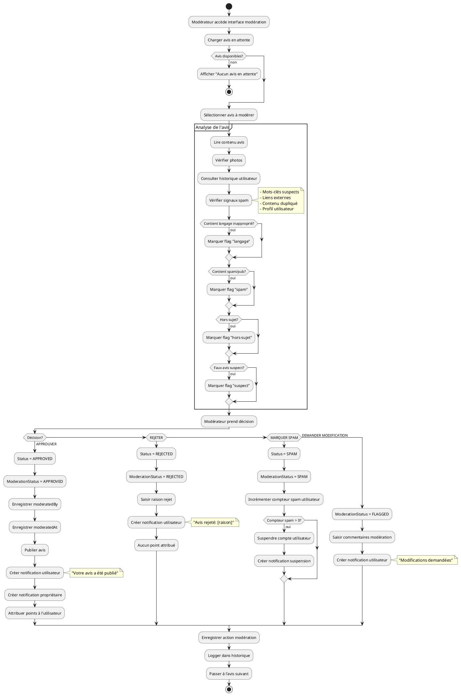

---

## 6. Processus de Modération de Check-In

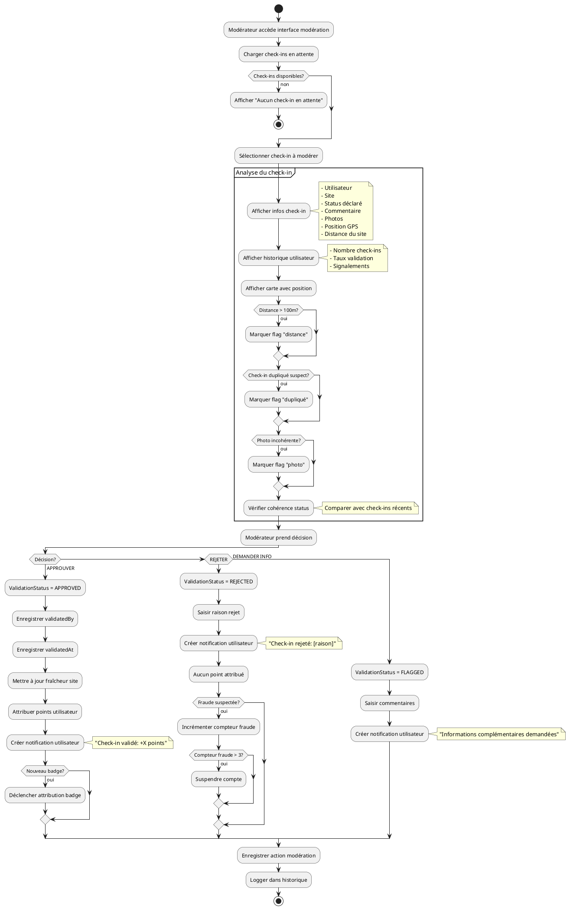

---

## 7. Processus d'Attribution de Badge

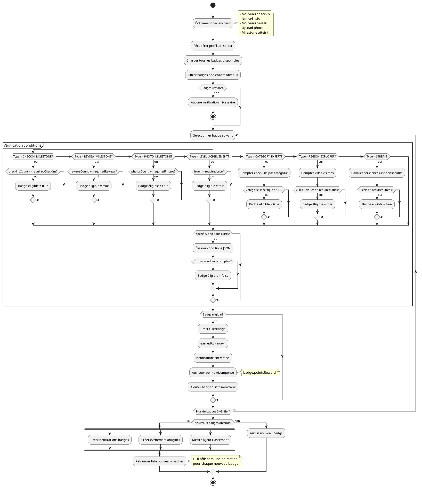

---

## 8. Processus de Level-Up

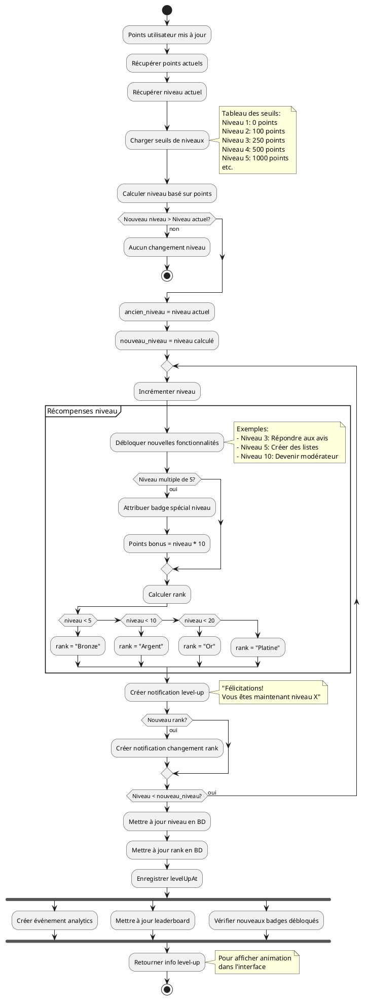

---

## 9. Processus de Paiement Stripe

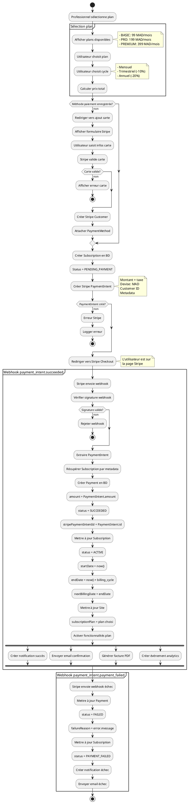

---

## 10. Processus de Recherche de Sites

```plantuml
@startuml SiteSearch

start

:Utilisateur accède recherche;

:Afficher interface recherche;

partition "Saisie critères" {
  
  if (Recherche textuelle?) then (oui)
    :Saisir mots-clés;
  endif
  
  if (Filtrer par catégorie?) then (oui)
    :Sélectionner catégories;
    note right
      - Restaurant
      - Hôtel
      - Musée
      - etc.
    end note
  endif
  
  if (Filtrer par localisation?) then (oui)
    
    if (Utiliser position actuelle?) then (oui)
      :Demander permission GPS;
      
      if (Permission accordée?) then (oui)
        :Récupérer position GPS;
        :Définir rayon recherche;
      else (non)
        :Saisir ville manuellement;
      endif
      
    else (non)
      :Saisir adresse/ville;
      :Géocoder adresse;
    endif
    
  endif
  
  if (Filtrer par note?) then (oui)
    :Sélectionner note minimum;
    note right: >= 3, >= 4, >= 4.5
  endif
  
  if (Filtrer par fraîcheur?) then (oui)
    :Sélectionner fraîcheur minimum;
    note right
      - Vérifié < 24h
      - Vérifié < 7 jours
      - Vérifié < 30 jours
    end note
  endif
  
  if (Filtrer par prix?) then (oui)
    :Sélectionner gamme prix;
  endif
  
  if (Filtrer par équipements?) then (oui)
    :Sélectionner équipements;
    note right
      - WiFi
      - Parking
      - Accessible
      - Paiement carte
    end note
  endif
}

:Construire requête recherche;

if (Position GPS disponible?) then (oui)
  :Trier par distance;
else (non)
  :Trier par pertinence;
endif

:Exécuter recherche en BD;

if (Résultats trouvés?) then (non)
  :Afficher "Aucun résultat";
  :Suggérer élargir critères;
  stop
endif

partition "Traitement résultats" {
  
  :Charger sites (pagination);
  
  fork
    :Calculer distance pour chaque site;
  fork again
    :Charger photos principales;
  fork again
    :Charger notes moyennes;
  fork again
    :Charger fraîcheur;
  end fork
  
  :Appliquer tri choisi;
  note right
    - Distance
    - Note
    - Fraîcheur
    - Popularité
    - Prix
  end note
}

:Afficher résultats;

if (Afficher sur carte?) then (oui)
  :Afficher carte avec markers;
  :Centrer sur résultats;
endif

:Afficher liste résultats;

partition "Interaction résultats" {
  
  repeat
    
    if (Scroll vers le bas?) then (oui)
      if (Plus de résultats?) then (oui)
        :Charger page suivante;
      endif
    endif
    
    if (Clic sur site?) then (oui)
      :Ouvrir détails site;
      stop
    endif
    
    if (Modifier filtres?) then (oui)
      :Retour saisie critères;
    endif
    
  repeat while (Utilisateur actif?) is (oui)
  
}

stop

@enduml
```

---

## 11. Processus d'Inscription

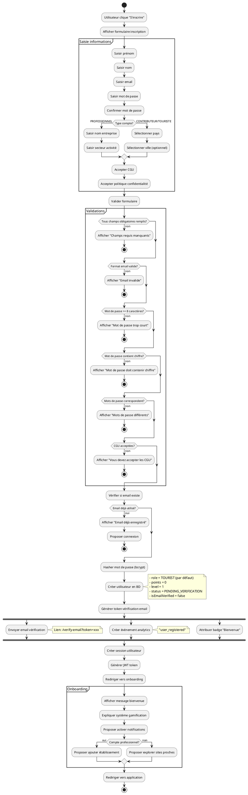

---

## 12. Processus de Récupération de Mot de Passe

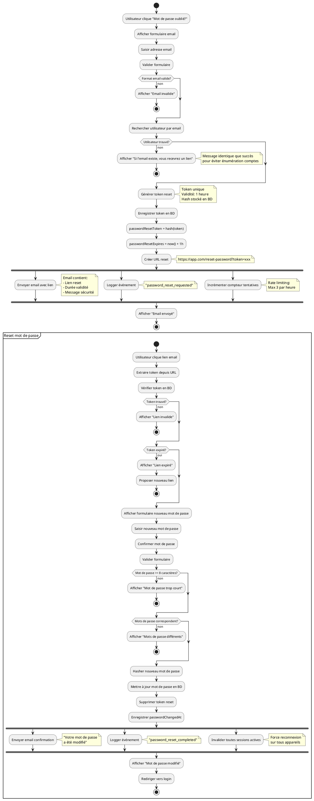

---

## Instructions d'utilisation

### Génération des diagrammes

**Option 1 - En ligne (Recommandé)** :
```
1. Allez sur http://www.plantuml.com/plantuml/
2. Copiez le code UML
3. Collez dans l'éditeur
4. Cliquez "Submit"
5. Téléchargez en PNG/SVG/PDF
```

**Option 2 - VS Code** :
```
1. Installez l'extension "PlantUML"
2. Créez un fichier .puml
3. Collez le code
4. Appuyez Alt+D pour prévisualiser
```

**Option 3 - CLI** :
```bash
# Installation
brew install plantuml  # macOS
sudo apt-get install plantuml  # Linux

# Génération
plantuml activity_diagram.puml

# Génération en SVG
plantuml -tsvg activity_diagram.puml
```

### Personnalisation

Pour modifier les couleurs et styles, ajoutez au début du diagramme :

```plantuml
@startuml
skinparam backgroundColor #FEFEFE
skinparam activity {
  BackgroundColor #E3F2FD
  BorderColor #1976D2
  FontSize 12
  FontColor #000000
}
skinparam activityDiamond {
  BackgroundColor #FFF9C4
  BorderColor #F57C00
}
@enduml
```

---

**Document créé le 16 janvier 2026**  
**MoroccoCheck - Codes Source UML Diagrammes d'Activité**  
**Version 1.0 - Complet**
