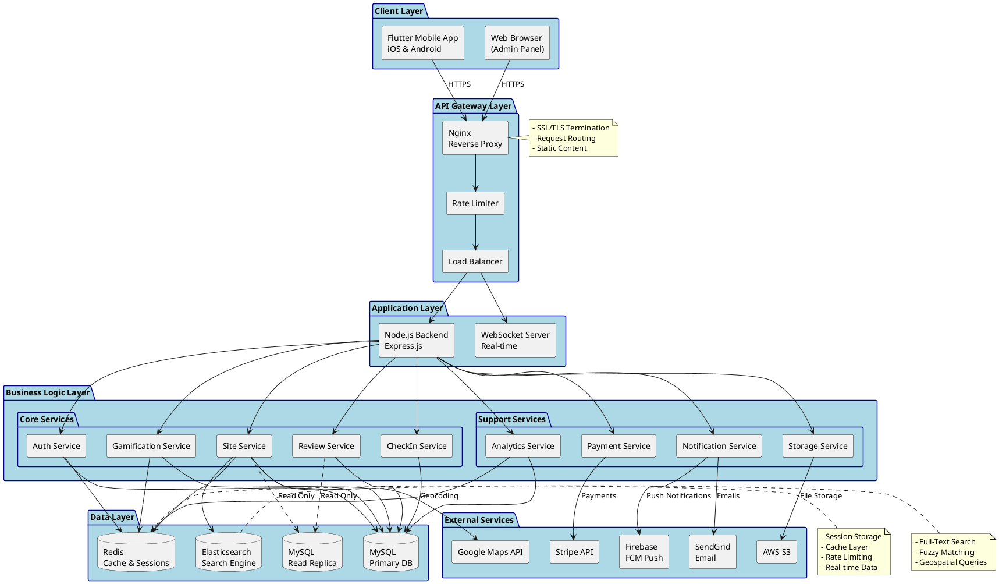
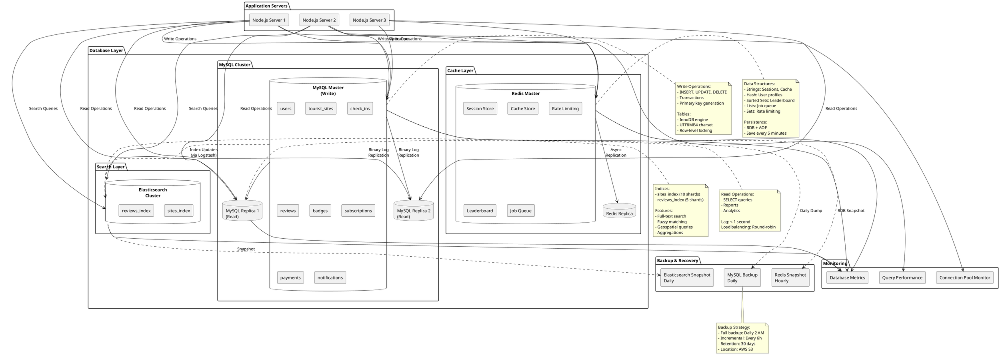
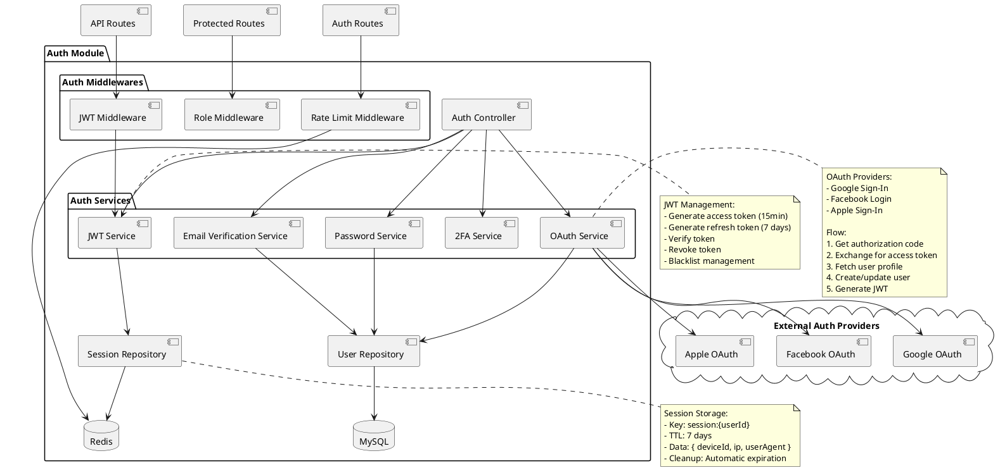
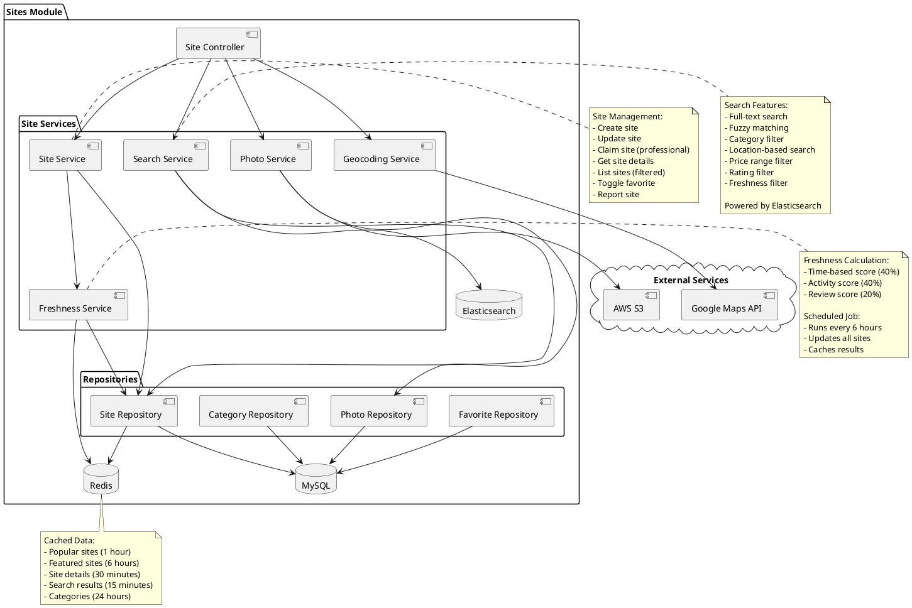
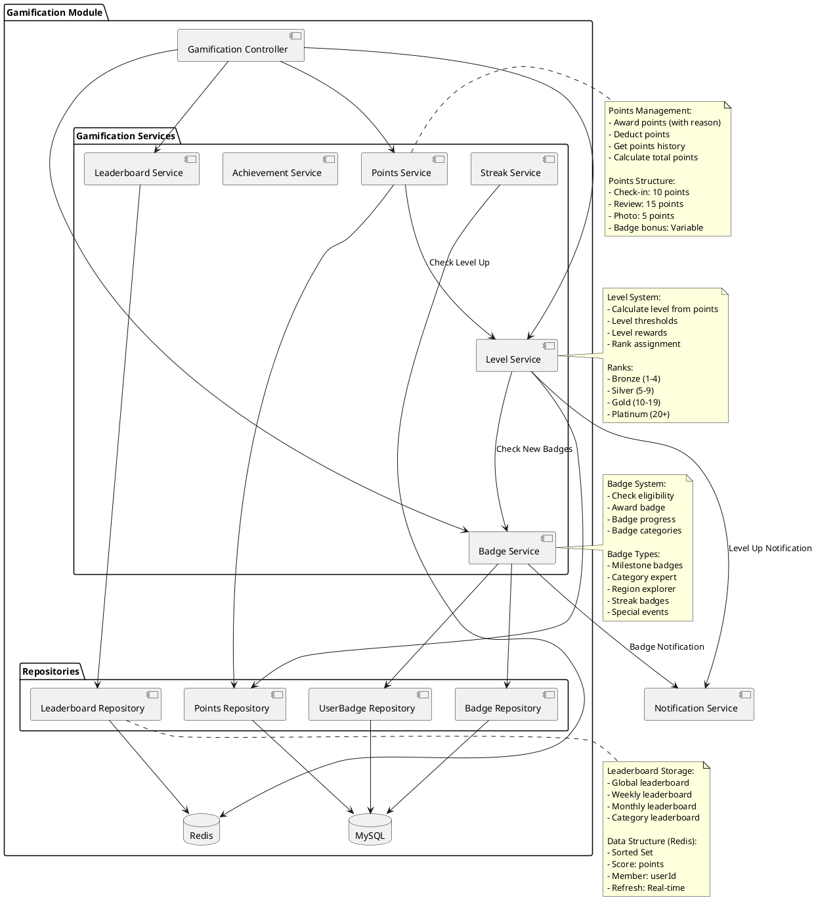
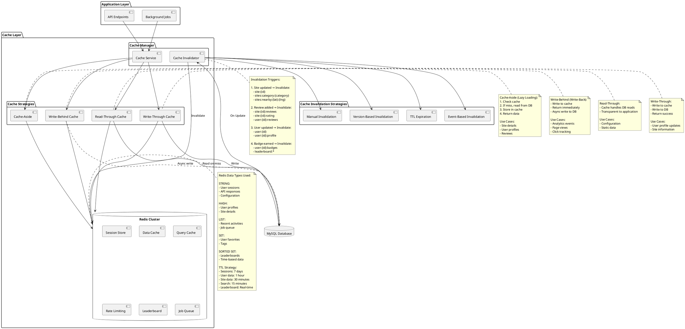
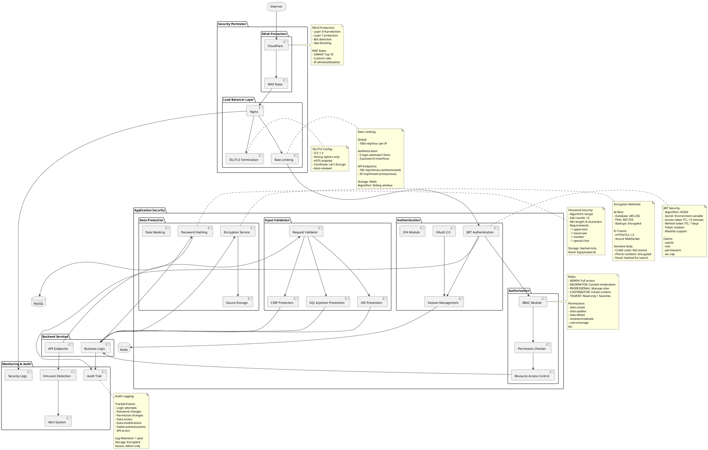
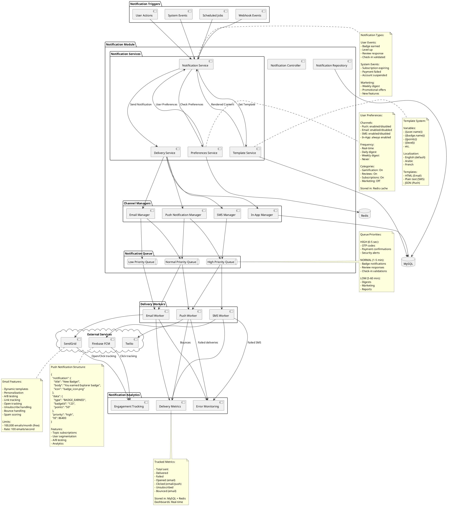

# Code Source UML - Diagrammes de Composants MoroccoCheck
## Codes PlantUML pour tous les diagrammes de composants

*Document créé le 16 janvier 2026*

---

## Table des Matières

1. [Architecture Globale du Système](#1-architecture-globale-du-système)
2. [Architecture Frontend Flutter](#2-architecture-frontend-flutter)
3. [Architecture Backend Node.js](#3-architecture-backend-nodejs)
4. [Architecture Base de Données](#4-architecture-base-de-données)
5. [Intégrations Services Externes](#5-intégrations-services-externes)
6. [Architecture de Déploiement](#6-architecture-de-déploiement)
7. [Composants par Module Métier](#7-composants-par-module-métier)
8. [Architecture de Cache](#8-architecture-de-cache)
9. [Architecture de Sécurité](#9-architecture-de-sécurité)
10. [Architecture de Notifications](#10-architecture-de-notifications)

---

## 1. Architecture Globale du Système



---

## 2. Architecture Frontend Flutter

```plantuml
@startuml FlutterArchitecture

!define RECTANGLE class

skinparam componentStyle rectangle
skinparam package {
  BackgroundColor #E3F2FD
  BorderColor #1976D2
}

package "Presentation Layer" {
  
  package "Screens" {
    [Auth Screens] as AuthScreens
    [Home Screen] as HomeScreen
    [Map Screen] as MapScreen
    [Site Details Screen] as SiteScreen
    [Profile Screen] as ProfileScreen
    [CheckIn Screen] as CheckInScreen
    [Review Screen] as ReviewScreen
    [Professional Dashboard] as ProDashboard
  }
  
  package "Widgets" {
    [Common Widgets] as CommonWidgets
    [Site Card Widget] as SiteCard
    [Map Marker Widget] as MapMarker
    [Rating Widget] as RatingWidget
    [Badge Widget] as BadgeWidget
    [Chart Widget] as ChartWidget
  }
}

package "State Management Layer" {
  
  package "Providers" {
    [Auth Provider] as AuthProvider
    [Sites Provider] as SitesProvider
    [Map Provider] as MapProvider
    [CheckIn Provider] as CheckInProvider
    [Review Provider] as ReviewProvider
    [Gamification Provider] as GamProvider
    [Subscription Provider] as SubProvider
  }
  
  [Provider Package\nChangeNotifier] as ProviderPkg
}

package "Business Logic Layer" {
  
  package "Services" {
    [API Service] as APIService
    [Auth Service] as AuthService
    [Location Service] as LocationService
    [Storage Service] as StorageService
    [Notification Service] as NotificationService
    [Image Service] as ImageService
  }
  
  package "Repositories" {
    [Site Repository] as SiteRepo
    [User Repository] as UserRepo
    [CheckIn Repository] as CheckInRepo
  }
}

package "Data Layer" {
  
  package "Models" {
    [User Model] as UserModel
    [Site Model] as SiteModel
    [CheckIn Model] as CheckInModel
    [Review Model] as ReviewModel
    [Badge Model] as BadgeModel
  }
  
  package "Local Storage" {
    [SQLite\nLocal DB] as SQLite
    [SharedPreferences\nKey-Value Store] as SharedPrefs
    [Secure Storage\nEncrypted] as SecureStorage
  }
  
  package "Network" {
    [HTTP Client\nDio] as Dio
    [WebSocket Client] as WSClient
  }
}

package "Core Layer" {
  [Constants] as Constants
  [Utils] as Utils
  [Validators] as Validators
  [Formatters] as Formatters
  [Theme] as Theme
  [Routes] as Routes
}

' Presentation -> State Management
AuthScreens --> AuthProvider
HomeScreen --> SitesProvider
MapScreen --> MapProvider
SiteScreen --> SitesProvider
ProfileScreen --> AuthProvider
ProfileScreen --> GamProvider
CheckInScreen --> CheckInProvider
ReviewScreen --> ReviewProvider
ProDashboard --> SubProvider

CommonWidgets --> ProviderPkg
SiteCard --> SitesProvider
MapMarker --> MapProvider
RatingWidget --> ReviewProvider
BadgeWidget --> GamProvider

' State Management -> Business Logic
AuthProvider --> AuthService
SitesProvider --> SiteRepo
MapProvider --> LocationService
CheckInProvider --> CheckInRepo
GamProvider --> APIService

' Providers connection
AuthProvider ..> ProviderPkg
SitesProvider ..> ProviderPkg
MapProvider ..> ProviderPkg
CheckInProvider ..> ProviderPkg
ReviewProvider ..> ProviderPkg
GamProvider ..> ProviderPkg

' Business Logic -> Data
APIService --> Dio
APIService --> UserModel
APIService --> SiteModel
AuthService --> SecureStorage
AuthService --> APIService
LocationService --> MapProvider
StorageService --> SharedPrefs
NotificationService --> FirebaseMessaging

SiteRepo --> APIService
SiteRepo --> SQLite
UserRepo --> APIService
UserRepo --> SQLite
CheckInRepo --> APIService

' Data Layer
Dio --> Backend : REST API
WSClient --> Backend : WebSocket

' Core Layer connections
AuthScreens ..> Routes
HomeScreen ..> Theme
Utils ..> Formatters
AuthService ..> Validators

package "External Packages" {
  [google_maps_flutter] as GMapsFlutter
  [geolocator] as Geolocator
  [image_picker] as ImagePicker
  [firebase_messaging] as FirebaseMessaging
  [cached_network_image] as CachedImage
}

MapScreen --> GMapsFlutter
LocationService --> Geolocator
ImageService --> ImagePicker
SiteCard --> CachedImage

cloud "Backend API" as Backend

note right of ProviderPkg
  State Management:
  - ChangeNotifier pattern
  - Reactive updates
  - Efficient rebuilds
end note

note right of SQLite
  Offline Support:
  - Cache sites
  - Save favorites
  - Queue pending actions
end note

note bottom of Dio
  HTTP Client Features:
  - Interceptors
  - Token refresh
  - Error handling
  - Retry logic
end note

@enduml
```

---

## 3. Architecture Backend Node.js

```plantuml
@startuml BackendArchitecture

!define RECTANGLE class

skinparam componentStyle rectangle
skinparam package {
  BackgroundColor #FFF3E0
  BorderColor #F57C00
}

package "API Layer" {
  
  [Express App] as ExpressApp
  
  package "Routes" {
    [Auth Routes] as AuthRoutes
    [Site Routes] as SiteRoutes
    [CheckIn Routes] as CheckInRoutes
    [Review Routes] as ReviewRoutes
    [User Routes] as UserRoutes
    [Subscription Routes] as SubRoutes
    [Admin Routes] as AdminRoutes
  }
  
  package "Middlewares" {
    [Auth Middleware] as AuthMW
    [Validation Middleware] as ValidationMW
    [Error Middleware] as ErrorMW
    [Rate Limit Middleware] as RateLimitMW
    [CORS Middleware] as CORSMW
    [Logger Middleware] as LoggerMW
    [Upload Middleware] as UploadMW
  }
}

package "Controller Layer" {
  [Auth Controller] as AuthCtrl
  [Site Controller] as SiteCtrl
  [CheckIn Controller] as CheckInCtrl
  [Review Controller] as ReviewCtrl
  [User Controller] as UserCtrl
  [Subscription Controller] as SubCtrl
  [Admin Controller] as AdminCtrl
}

package "Service Layer" {
  
  package "Core Services" {
    [Auth Service] as AuthSvc
    [Site Service] as SiteSvc
    [CheckIn Service] as CheckInSvc
    [Review Service] as ReviewSvc
    [User Service] as UserSvc
    [Gamification Service] as GamSvc
  }
  
  package "Infrastructure Services" {
    [Email Service] as EmailSvc
    [SMS Service] as SMSSvc
    [Storage Service] as StorageSvc
    [Notification Service] as NotifSvc
    [Cache Service] as CacheSvc
    [Queue Service] as QueueSvc
  }
  
  package "Integration Services" {
    [Payment Service] as PaymentSvc
    [Maps Service] as MapsSvc
    [Analytics Service] as AnalyticsSvc
  }
}

package "Repository Layer" {
  [User Repository] as UserRepo
  [Site Repository] as SiteRepo
  [CheckIn Repository] as CheckInRepo
  [Review Repository] as ReviewRepo
  [Badge Repository] as BadgeRepo
  [Subscription Repository] as SubRepo
  [Payment Repository] as PaymentRepo
}

package "Model Layer" {
  [User Model] as UserModel
  [Site Model] as SiteModel
  [CheckIn Model] as CheckInModel
  [Review Model] as ReviewModel
  [Badge Model] as BadgeModel
  [Subscription Model] as SubModel
  [Payment Model] as PaymentModel
}

package "Data Access Layer" {
  [MySQL Connection Pool] as MySQLPool
  [Redis Client] as RedisClient
  [Elasticsearch Client] as ElasticClient
}

package "Utility Layer" {
  [Logger] as Logger
  [Validator] as Validator
  [Error Handler] as ErrorHandler
  [JWT Utils] as JWTUtils
  [Crypto Utils] as CryptoUtils
  [Date Utils] as DateUtils
}

package "Config Layer" {
  [Database Config] as DBConfig
  [Redis Config] as RedisConfig
  [AWS Config] as AWSConfig
  [Stripe Config] as StripeConfig
  [Email Config] as EmailConfig
}

' API Layer connections
ExpressApp --> AuthRoutes
ExpressApp --> SiteRoutes
ExpressApp --> CheckInRoutes
ExpressApp --> ReviewRoutes
ExpressApp --> UserRoutes
ExpressApp --> SubRoutes
ExpressApp --> AdminRoutes

ExpressApp --> AuthMW
ExpressApp --> ValidationMW
ExpressApp --> ErrorMW
ExpressApp --> RateLimitMW
ExpressApp --> CORSMW
ExpressApp --> LoggerMW

' Routes to Controllers
AuthRoutes --> AuthCtrl
SiteRoutes --> SiteCtrl
CheckInRoutes --> CheckInCtrl
ReviewRoutes --> ReviewCtrl
UserRoutes --> UserCtrl
SubRoutes --> SubCtrl
AdminRoutes --> AdminCtrl

' Middlewares
AuthMW --> JWTUtils
ValidationMW --> Validator
RateLimitMW --> RedisClient
LoggerMW --> Logger
UploadMW --> StorageSvc

' Controllers to Services
AuthCtrl --> AuthSvc
SiteCtrl --> SiteSvc
CheckInCtrl --> CheckInSvc
ReviewCtrl --> ReviewSvc
UserCtrl --> UserSvc
SubCtrl --> PaymentSvc

' Core Services to Repositories
AuthSvc --> UserRepo
SiteSvc --> SiteRepo
CheckInSvc --> CheckInRepo
CheckInSvc --> GamSvc
ReviewSvc --> ReviewRepo
ReviewSvc --> GamSvc
UserSvc --> UserRepo
GamSvc --> BadgeRepo

' Services to Infrastructure
AuthSvc --> EmailSvc
AuthSvc --> CacheSvc
CheckInSvc --> NotifSvc
ReviewSvc --> QueueSvc
PaymentSvc --> NotifSvc

' Services to Integrations
SiteSvc --> MapsSvc
CheckInSvc --> MapsSvc
PaymentSvc --> StripeAPI
NotifSvc --> FirebaseAPI
EmailSvc --> SendGridAPI
StorageSvc --> S3API

' Repositories to Models
UserRepo --> UserModel
SiteRepo --> SiteModel
CheckInRepo --> CheckInModel
ReviewRepo --> ReviewModel
BadgeRepo --> BadgeModel
SubRepo --> SubModel
PaymentRepo --> PaymentModel

' Models to Data Access
UserModel --> MySQLPool
SiteModel --> MySQLPool
SiteModel --> ElasticClient
CheckInModel --> MySQLPool
ReviewModel --> MySQLPool
BadgeModel --> MySQLPool

' Cache Service
CacheSvc --> RedisClient
GamSvc --> RedisClient

' Config connections
MySQLPool ..> DBConfig
RedisClient ..> RedisConfig
StorageSvc ..> AWSConfig
PaymentSvc ..> StripeConfig
EmailSvc ..> EmailConfig

' External APIs
cloud "Stripe API" as StripeAPI
cloud "Firebase FCM" as FirebaseAPI
cloud "SendGrid API" as SendGridAPI
cloud "AWS S3" as S3API
cloud "Google Maps API" as MapsAPI

MapsSvc --> MapsAPI

note right of ExpressApp
  Entry Point:
  - Port 3000
  - JSON API
  - REST endpoints
  - WebSocket support
end note

note right of MySQLPool
  Connection Pool:
  - Min: 5 connections
  - Max: 20 connections
  - Timeout: 30s
end note

note right of RedisClient
  Redis Usage:
  - Session store
  - Cache layer
  - Rate limiting
  - Job queue
  - Leaderboard
end note

note bottom of QueueSvc
  Background Jobs:
  - Email sending
  - Image processing
  - Analytics
  - Freshness calculation
end note

@enduml
```

---

## 4. Architecture Base de Données



---

## 5. Intégrations Services Externes

```plantuml
@startuml ExternalIntegrations

!define RECTANGLE class

skinparam componentStyle rectangle

package "MoroccoCheck Backend" {
  [Payment Service] as PaymentSvc
  [Maps Service] as MapsSvc
  [Storage Service] as StorageSvc
  [Notification Service] as NotifSvc
  [Email Service] as EmailSvc
  [SMS Service] as SMSSvc
  [Analytics Service] as AnalyticsSvc
}

package "Payment Integration" {
  cloud "Stripe API" as Stripe {
    [Payment Intents]
    [Customers]
    [Subscriptions]
    [Webhooks]
    [Invoices]
  }
}

package "Maps Integration" {
  cloud "Google Maps Platform" as GMaps {
    [Geocoding API]
    [Places API]
    [Distance Matrix API]
    [Maps Static API]
    [Directions API]
  }
}

package "Storage Integration" {
  cloud "AWS Services" as AWS {
    [S3 Buckets]
    [CloudFront CDN]
    [Lambda Functions]
  }
  
  folder "S3 Buckets" {
    [morocco-check-photos]
    [morocco-check-documents]
    [morocco-check-backups]
  }
}

package "Notification Integration" {
  cloud "Firebase" as Firebase {
    [FCM (Push Notifications)]
    [Cloud Messaging]
    [Analytics]
  }
}

package "Email Integration" {
  cloud "SendGrid" as SendGrid {
    [Transactional Emails]
    [Email Templates]
    [Email Analytics]
    [Webhooks]
  }
}

package "SMS Integration" {
  cloud "Twilio" as Twilio {
    [SMS API]
    [Phone Verification]
    [2FA]
  }
}

package "Analytics Integration" {
  cloud "Google Analytics" as GA {
    [GA4]
    [Events Tracking]
    [User Behavior]
  }
  
  cloud "Mixpanel" as Mixpanel {
    [Event Analytics]
    [Funnels]
    [Retention]
  }
}

package "Monitoring Integration" {
  cloud "Sentry" as Sentry {
    [Error Tracking]
    [Performance Monitoring]
  }
  
  cloud "New Relic" as NewRelic {
    [APM]
    [Infrastructure]
  }
}

' Payment Service Integration
PaymentSvc --> Stripe : HTTPS/REST
PaymentSvc --> [Payment Intents] : Create Payment
PaymentSvc --> [Subscriptions] : Manage Subscriptions
PaymentSvc --> [Customers] : Customer Management
Stripe --> PaymentSvc : Webhook Events

' Maps Service Integration
MapsSvc --> [Geocoding API] : Address → Coordinates
MapsSvc --> [Places API] : Place Search
MapsSvc --> [Distance Matrix API] : Calculate Distance
MapsSvc --> [Directions API] : Get Directions

' Storage Service Integration
StorageSvc --> [S3 Buckets] : Upload/Download
StorageSvc --> [CloudFront CDN] : Serve Static Content
[S3 Buckets] --> [Lambda Functions] : Image Processing

' Notification Service Integration
NotifSvc --> [FCM (Push Notifications)] : Send Push
NotifSvc --> Firebase : Device Token Management

' Email Service Integration
EmailSvc --> SendGrid : Send Email
EmailSvc --> [Email Templates] : Use Templates
SendGrid --> EmailSvc : Delivery Webhooks

' SMS Service Integration
SMSSvc --> Twilio : Send SMS
SMSSvc --> [Phone Verification] : Verify Phone

' Analytics Service Integration
AnalyticsSvc --> GA : Track Events
AnalyticsSvc --> Mixpanel : User Analytics

' Monitoring
[All Services] --> Sentry : Error Reporting
[All Services] --> NewRelic : Performance Metrics

note right of Stripe
  Stripe Integration:
  - API Version: 2023-10-16
  - Webhook secret validation
  - Idempotency keys
  - Test mode for development
  
  Payment Flow:
  1. Create Payment Intent
  2. Confirm Payment
  3. Handle Webhook
  4. Update Subscription
end note

note right of GMaps
  Google Maps Quotas:
  - Geocoding: 50 req/sec
  - Places: 100 req/sec
  - Distance Matrix: 100 req/sec
  
  Features Used:
  - Autocomplete
  - Place Details
  - Nearby Search
  - Geocoding
end note

note right of AWS
  S3 Configuration:
  - Bucket Policy: Private
  - CDN: CloudFront
  - Lifecycle: 90 days
  
  Lambda Triggers:
  - Image compression
  - Thumbnail generation
  - EXIF data extraction
end note

note right of Firebase
  FCM Implementation:
  - Topic Subscriptions
  - User Segments
  - Notification Priority
  - Data Payload
  
  Notification Types:
  - Badge earned
  - Level up
  - New review
  - Subscription expiring
end note

note bottom of SendGrid
  Email Templates:
  - Welcome email
  - Email verification
  - Password reset
  - Receipt/Invoice
  - Weekly digest
  
  Tracking:
  - Opens
  - Clicks
  - Bounces
  - Unsubscribes
end note

@enduml
```



---

## 6. Architecture de Déploiement

```plantuml
@startuml DeploymentArchitecture

!define RECTANGLE class

skinparam nodeStyle rectangle

node "Load Balancer" {
  [Nginx Load Balancer] as LB
}

node "Application Servers" {
  node "Server 1 (us-east-1a)" {
    [Node.js App] as App1
    [PM2 Process Manager] as PM2_1
  }
  
  node "Server 2 (us-east-1b)" {
    [Node.js App] as App2
    [PM2 Process Manager] as PM2_2
  }
  
  node "Server 3 (us-east-1c)" {
    [Node.js App] as App3
    [PM2 Process Manager] as PM2_3
  }
}

node "Database Cluster" {
  node "Primary DB (us-east-1a)" {
    database "MySQL Master" as DBMaster
  }
  
  node "Replica DB 1 (us-east-1b)" {
    database "MySQL Replica" as DBReplica1
  }
  
  node "Replica DB 2 (us-east-1c)" {
    database "MySQL Replica" as DBReplica2
  }
}

node "Cache Cluster" {
  node "Redis Master (us-east-1a)" {
    database "Redis Primary" as RedisMaster
  }
  
  node "Redis Replica (us-east-1b)" {
    database "Redis Standby" as RedisReplica
  }
}

node "Search Cluster" {
  node "Elasticsearch Node 1" {
    [Elasticsearch] as ES1
  }
  
  node "Elasticsearch Node 2" {
    [Elasticsearch] as ES2
  }
}

cloud "CDN" {
  [CloudFront] as CDN
}

cloud "Storage" {
  [AWS S3] as S3
}

cloud "Mobile Clients" {
  [iOS App] as iOS
  [Android App] as Android
}

cloud "Web Clients" {
  [Admin Panel] as WebAdmin
}

' Client connections
iOS --> CDN : Static Assets
Android --> CDN : Static Assets
iOS --> LB : API Requests
Android --> LB : API Requests
WebAdmin --> LB : Admin API

' Load Balancer
LB --> App1 : Round Robin
LB --> App2 : Round Robin
LB --> App3 : Round Robin

' PM2 Management
PM2_1 --> App1 : Manage Process
PM2_2 --> App2 : Manage Process
PM2_3 --> App3 : Manage Process

' Application to Database
App1 --> DBMaster : Write
App2 --> DBMaster : Write
App3 --> DBMaster : Write

App1 --> DBReplica1 : Read
App2 --> DBReplica1 : Read
App3 --> DBReplica2 : Read

' Database Replication
DBMaster --> DBReplica1 : Replication
DBMaster --> DBReplica2 : Replication

' Application to Cache
App1 --> RedisMaster
App2 --> RedisMaster
App3 --> RedisMaster

RedisMaster --> RedisReplica : Replication

' Application to Search
App1 --> ES1
App2 --> ES2
App3 --> ES1

ES1 <--> ES2 : Cluster Sync

' Static Assets
CDN --> S3 : Origin
App1 --> S3 : Upload
App2 --> S3 : Upload

node "Monitoring & Logs" {
  [CloudWatch] as CloudWatch
  [Log Aggregator] as Logs
  [Metrics Dashboard] as Metrics
}

App1 --> CloudWatch : Logs & Metrics
App2 --> CloudWatch : Logs & Metrics
App3 --> CloudWatch : Logs & Metrics
DBMaster --> CloudWatch : DB Metrics
RedisMaster --> CloudWatch : Cache Metrics

CloudWatch --> Logs
CloudWatch --> Metrics

node "CI/CD Pipeline" {
  [GitHub Actions] as GitHub
  [Docker Registry] as DockerReg
}

GitHub --> DockerReg : Build & Push
DockerReg --> App1 : Deploy
DockerReg --> App2 : Deploy
DockerReg --> App3 : Deploy

note right of LB
  Load Balancer Config:
  - Algorithm: Round Robin
  - Health Check: /health
  - Timeout: 30s
  - SSL/TLS Termination
  - Rate Limiting
end note

note right of App1
  Application Config:
  - Runtime: Node.js 18
  - Process Manager: PM2
  - Instances: 4 (cluster mode)
  - Memory: 2GB
  - CPU: 2 vCPUs
end note

note right of DBMaster
  Database Config:
  - Instance: db.r5.xlarge
  - Storage: 100GB SSD
  - Backup: Daily
  - Multi-AZ: Yes
end note

note right of RedisMaster
  Redis Config:
  - Instance: cache.r5.large
  - Memory: 13GB
  - Persistence: RDB + AOF
  - Eviction: allkeys-lru
end note

note bottom of S3
  S3 Buckets:
  - morocco-check-photos
  - morocco-check-documents
  - morocco-check-backups
  
  Lifecycle:
  - Photos: 90 days
  - Documents: Indefinite
  - Backups: 30 days
end note

@enduml
```

---

## 7. Composants par Module Métier

### 7.1 Module Authentification



### 7.2 Module Sites Touristiques



### 7.3 Module Gamification



---

## 8. Architecture de Cache



---

## 9. Architecture de Sécurité



---

## 10. Architecture de Notifications



---

## Instructions d'utilisation

### Génération des diagrammes

**Option 1 - PlantUML Online** :
```
1. Allez sur http://www.plantuml.com/plantuml/
2. Copiez le code UML
3. Collez dans l'éditeur
4. Cliquez "Submit"
5. Téléchargez en PNG/SVG/PDF
```

**Option 2 - VS Code** :
```
1. Installez l'extension "PlantUML"
2. Créez un fichier .puml
3. Collez le code
4. Appuyez Alt+D pour prévisualiser
5. Clic droit → Export pour sauvegarder
```

**Option 3 - Ligne de commande** :
```bash
# Installation (macOS)
brew install plantuml

# Installation (Linux)
sudo apt-get install plantuml

# Génération PNG
plantuml architecture.puml

# Génération SVG (recommandé pour qualité)
plantuml -tsvg architecture.puml

# Génération multiple
plantuml *.puml
```

### Personnalisation des styles

Ajoutez au début de chaque diagramme pour personnaliser :

```plantuml
@startuml
' Couleurs personnalisées
skinparam backgroundColor #FEFEFE
skinparam componentStyle rectangle

skinparam component {
  BackgroundColor #E3F2FD
  BorderColor #1976D2
  FontSize 12
  FontColor #000000
}

skinparam package {
  BackgroundColor #F3E5F5
  BorderColor #7B1FA2
  FontSize 14
}

skinparam database {
  BackgroundColor #E8F5E9
  BorderColor #388E3C
}

skinparam cloud {
  BackgroundColor #FFF3E0
  BorderColor #F57C00
}

' Flèches
skinparam ArrowColor #1976D2
skinparam ArrowThickness 2

@enduml
```

### Export en haute qualité

Pour des diagrammes en haute résolution :

```bash
# Export SVG (vectoriel, meilleure qualité)
plantuml -tsvg diagram.puml

# Export PNG haute résolution
plantuml -tpng -Sdpi=300 diagram.puml

# Export PDF
plantuml -tpdf diagram.puml
```

---

## Récapitulatif des Diagrammes

| Diagramme | Description | Utilisation |
|-----------|-------------|-------------|
| Architecture Globale | Vue d'ensemble du système | Comprendre l'architecture complète |
| Frontend Flutter | Structure application mobile | Développement frontend |
| Backend Node.js | Structure API REST | Développement backend |
| Base de Données | Infrastructure de données | Setup et optimisation DB |
| Services Externes | Intégrations tierces | Configuration APIs |
| Déploiement | Infrastructure cloud | DevOps et déploiement |
| Modules Métier | Composants par domaine | Organisation du code |
| Cache | Stratégies de mise en cache | Performance |
| Sécurité | Architecture de sécurité | Audit et compliance |
| Notifications | Système de notifications | Engagement utilisateur |

---

**Document créé le 16 janvier 2026**  
**MoroccoCheck - Codes Source UML Diagrammes de Composants**  
**Version 1.0 - Complet**
