# Code Source UML - Diagrammes d'États MoroccoCheck
## Codes PlantUML pour tous les diagrammes d'états

*Document créé le 16 janvier 2026*

---

## Table des Matières

1. [États d'un Utilisateur](#1-états-dun-utilisateur)
2. [États d'un Check-In](#2-états-dun-check-in)
3. [États d'un Avis (Review)](#3-états-dun-avis-review)
4. [États d'un Site Touristique](#4-états-dun-site-touristique)
5. [États d'un Abonnement](#5-états-dun-abonnement)
6. [États d'un Paiement](#6-états-dun-paiement)
7. [États d'une Photo](#7-états-dune-photo)
8. [États d'une Notification](#8-états-dune-notification)
9. [États d'un Badge](#9-états-dun-badge)
10. [États d'une Session](#10-états-dune-session)

---

## 1. États d'un Utilisateur

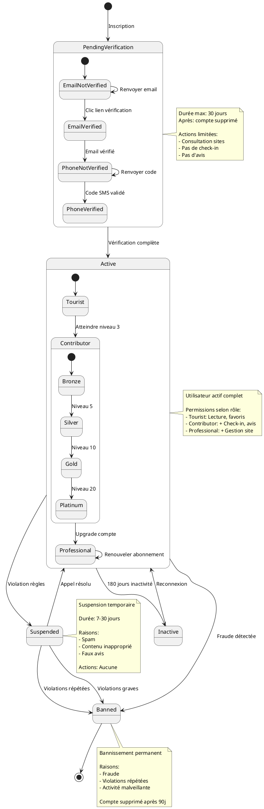

---

## 2. États d'un Check-In

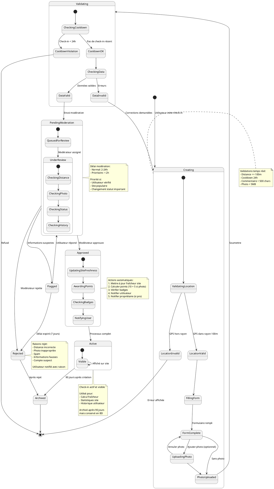

---

## 3. États d'un Avis (Review)

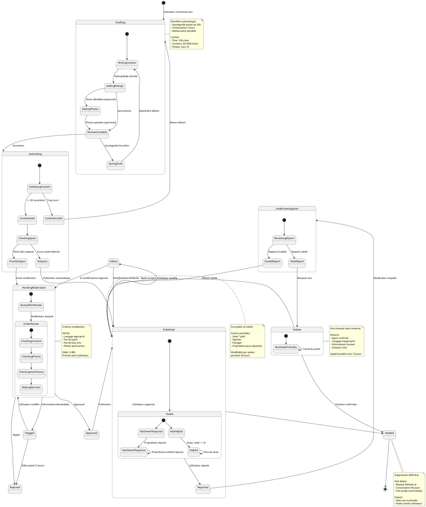

---

## 4. États d'un Site Touristique

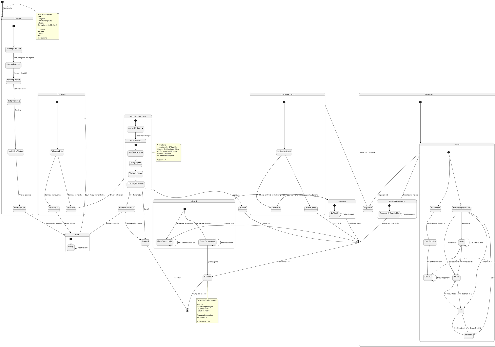

---

## 5. États d'un Abonnement

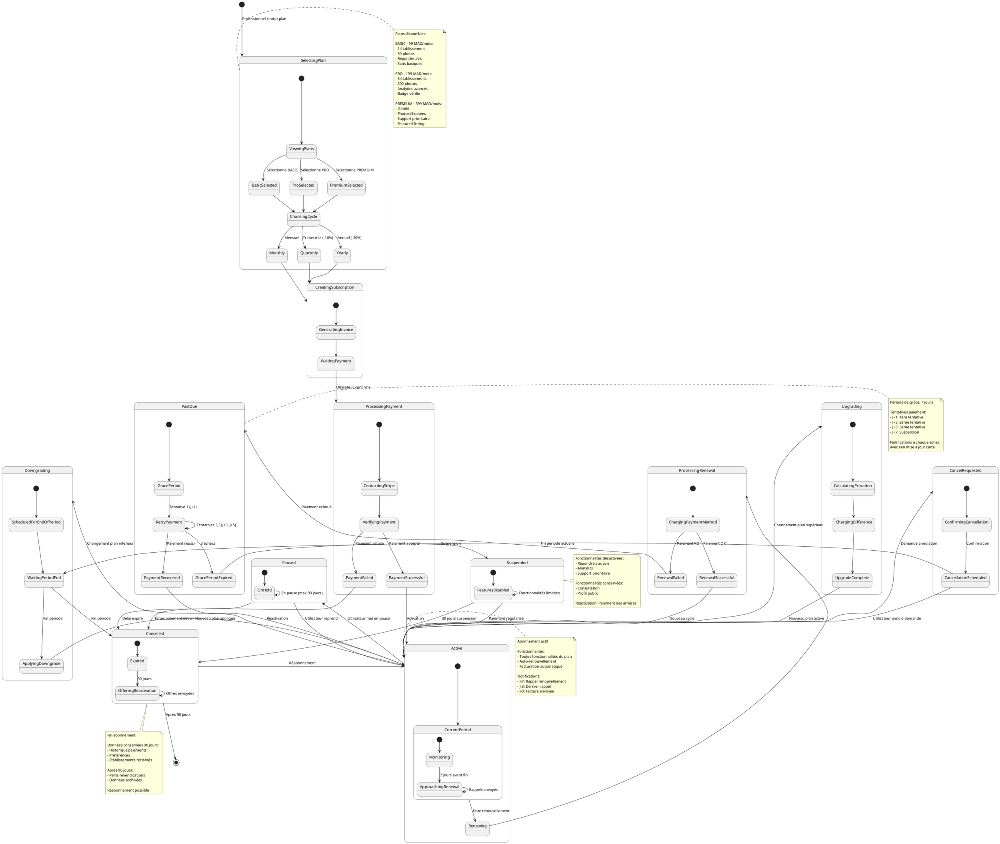

---

## 6. États d'un Paiement

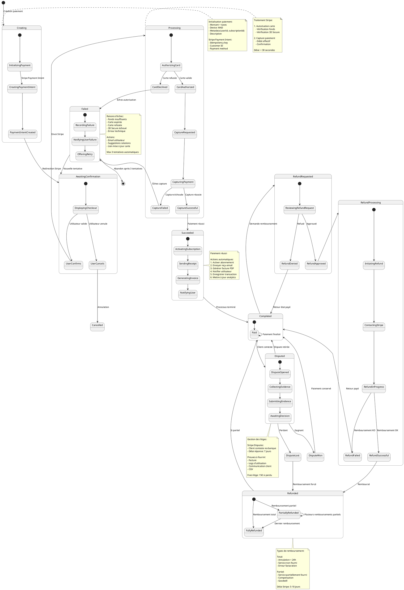

---

## 7. États d'une Photo

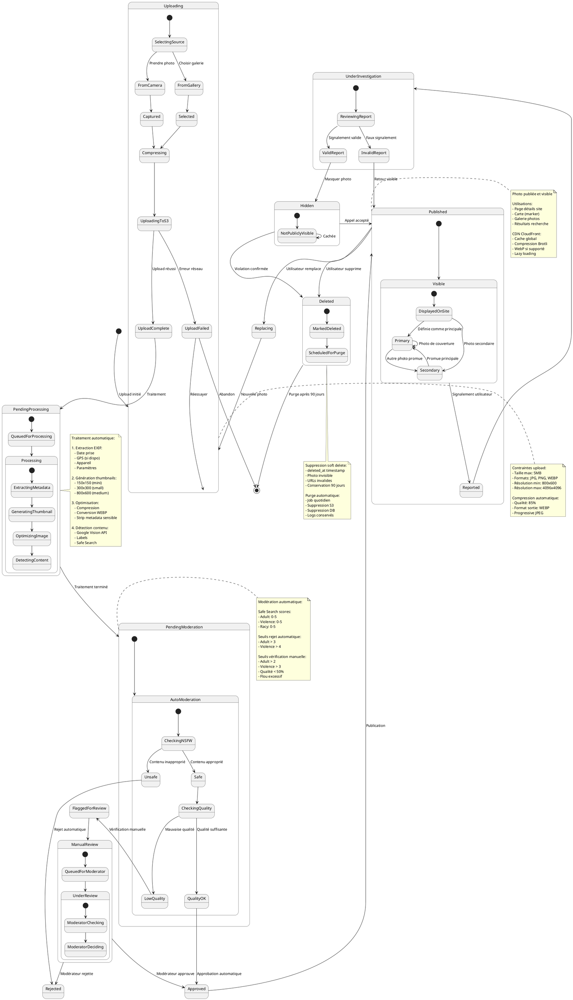

---

## 8. États d'une Notification

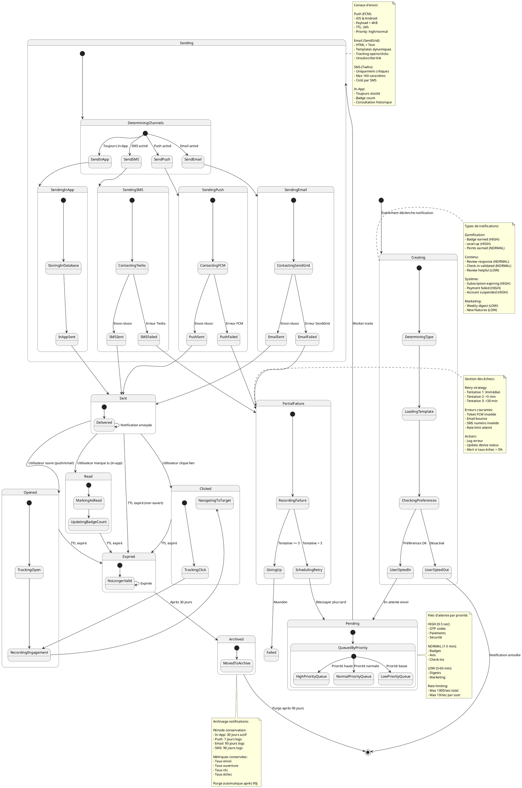

---

## 9. États d'un Badge

```plantuml
@startuml BadgeStates

[*] --> Locked : Badge créé

state Locked {
  [*] --> NotEarned
  
  state NotEarned {
    [*] --> TrackingProgress
    TrackingProgress --> CalculatingProgress
    CalculatingProgress --> Progress0 : 0%
    CalculatingProgress --> Progress25 : 25%
    CalculatingProgress --> Progress50 : 50%
    CalculatingProgress --> Progress75 : 75%
    
    Progress0 --> Progress25 : Progrès
    Progress25 --> Progress50 : Progrès
    Progress50 --> Progress75 : Progrès
    Progress75 --> Progress100 : Progrès
  }
}

Progress100 --> Unlocking : Conditions remplies

state Unlocking {
  [*] --> VerifyingConditions
  VerifyingConditions --> AllConditionsMet : Toutes OK
  VerifyingConditions --> SomeConditionsMissing : Manque conditions
}

SomeConditionsMissing --> Locked : Retour verrouillé

AllConditionsMet --> Awarding : Attribution

state Awarding {
  [*] --> CreatingUserBadge
  CreatingUserBadge --> AwardingPoints
  AwardingPoints --> CreatingNotification
  CreatingNotification --> LoggingAchievement
}

Awarding --> Earned : Badge obtenu

state Earned {
  [*] --> NewlyEarned
  NewlyEarned --> NotificationSent : Notification envoyée
  NotificationSent --> Acknowledged : Utilisateur voit
  
  Acknowledged --> Displayed : Badge affiché profil
  Acknowledged --> Hidden : Badge caché
  
  state Displayed {
    [*] --> VisibleOnProfile
    VisibleOnProfile --> VisibleOnProfile : Affiché publiquement
  }
  
  state Hidden {
    [*] --> NotVisibleOnProfile
    NotVisibleOnProfile --> NotVisibleOnProfile : Caché du public
  }
  
  Hidden --> Displayed : Utilisateur affiche
  Displayed --> Hidden : Utilisateur cache
}

Earned --> Showcased : Badge mis en avant

state Showcased {
  [*] --> FeaturedOnProfile
  FeaturedOnProfile --> FeaturedOnProfile : Badge principal
}

Showcased --> Earned : Autre badge showcased

note right of Locked
  Badge verrouillé
  
  États utilisateur:
  - Visible dans liste badges
  - Conditions affichées
  - Progression visible
  - Incitation à déverrouiller
  
  Types conditions:
  - Check-ins: X check-ins
  - Reviews: X avis
  - Photos: X photos
  - Level: Niveau X
  - Streak: X jours consécutifs
  - Category: Expert catégorie
  - Region: Explorer ville
end note

note right of NotEarned
  Suivi de progression:
  
  Calcul en temps réel:
  - Après chaque action utilisateur
  - Check-in → Vérifier badges check-in
  - Review → Vérifier badges review
  - Level up → Vérifier badges niveau
  
  Affichage progression:
  - Barre progression 0-100%
  - "Plus que X check-ins"
  - "Plus que X points"
  
  Encouragement:
  - Notification 75% : "Presque!"
  - Notification 90% : "Encore peu!"
end note

note right of Unlocking
  Vérification déverrouillage:
  
  Conditions types:
  
  Simple:
  - checkinsCount >= required
  
  Multiple AND:
  - checkinsCount >= X
  - reviewsCount >= Y
  - level >= Z
  
  Catégorie spécifique:
  - checkinsInCategory('restaurant') >= X
  
  Région spécifique:
  - uniqueCitiesVisited >= X
  
  Streak:
  - consecutiveDaysActive >= X
  
  Toutes conditions = true → Unlock
end note

note right of Awarding
  Attribution badge:
  
  Actions séquentielles:
  1. Créer UserBadge
     - userId, badgeId
     - earnedAt = now()
     - progress = 100%
  
  2. Attribuer points récompense
     - badge.pointsReward
     - Peut déclencher level-up
  
  3. Créer notification
     - Type: BADGE_EARNED
     - Priority: HIGH
     - Animation spéciale UI
  
  4. Logger événement
     - Analytics
     - Leaderboard update
end note

note right of Earned
  Badge obtenu
  
  Options utilisateur:
  - Afficher sur profil (défaut)
  - Cacher du public
  - Mettre en avant (showcase)
  
  Affichage public:
  - Page profil utilisateur
  - Liste badges
  - Réalisations
  
  Gamification:
  - Fierté accomplissement
  - Statut communauté
  - Motivation continue
end note

note bottom of Showcased
  Badge showcase:
  
  Limite: 1 badge en avant
  
  Affichage:
  - Grande taille profil
  - Animation spéciale
  - Badge le plus rare/récent
  
  Utilisé pour:
  - Montrer accomplissement
  - Badge préféré
  - Badge le plus rare
  
  Change automatiquement si:
  - Badge plus rare obtenu
  - Badge événement spécial
  (configurable par user)
end note

@enduml
```

---

## 10. États d'une Session

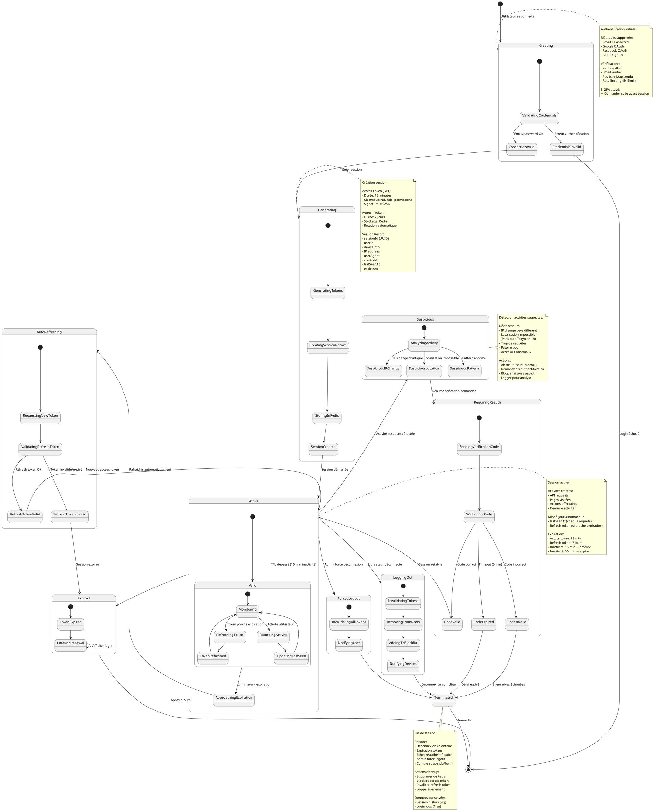

---

## Instructions d'utilisation

### Génération des diagrammes

**Option 1 - PlantUML Online (Recommandé pour débuter)** :
```
1. Allez sur http://www.plantuml.com/plantuml/
2. Copiez le code UML d'un diagramme
3. Collez dans l'éditeur web
4. Cliquez "Submit"
5. Téléchargez en PNG, SVG ou PDF
```

**Option 2 - VS Code (Pour développement)** :
```
1. Installez l'extension "PlantUML"
2. Créez un fichier avec extension .puml
3. Collez le code UML
4. Appuyez Alt+D pour prévisualiser
5. Clic droit → Export pour sauvegarder
```

**Option 3 - Ligne de commande (Pour batch)** :
```bash
# Installation macOS
brew install plantuml

# Installation Linux
sudo apt-get install plantuml graphviz

# Génération PNG
plantuml states.puml

# Génération SVG (vectoriel, meilleure qualité)
plantuml -tsvg states.puml

# Génération tous les .puml du dossier
plantuml *.puml

# Génération avec sortie personnalisée
plantuml -o ./output states.puml
```

### Personnalisation des styles

Ajoutez au début de chaque diagramme :

```plantuml
@startuml

' Couleurs personnalisées pour les états
skinparam state {
  BackgroundColor #E3F2FD
  BorderColor #1976D2
  FontSize 12
  FontColor #000000
  
  ' États spéciaux
  StartColor #4CAF50
  EndColor #F44336
  
  ' États actifs
  BackgroundColor<<Active>> #C8E6C9
  BorderColor<<Active>> #388E3C
  
  ' États d'erreur
  BackgroundColor<<Error>> #FFCDD2
  BorderColor<<Error>> #D32F2F
  
  ' États en attente
  BackgroundColor<<Pending>> #FFF9C4
  BorderColor<<Pending>> #F57C00
}

' Style des transitions
skinparam ArrowColor #1976D2
skinparam ArrowThickness 2

' Style des notes
skinparam note {
  BackgroundColor #FFFDE7
  BorderColor #F57C00
  FontSize 11
}

@enduml
```

### Utilisation des stéréotypes

Pour colorer automatiquement certains états :

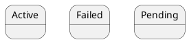

### Export haute qualité

```bash
# Export SVG (recommandé pour documentation)
plantuml -tsvg -charset UTF-8 states.puml

# Export PNG haute résolution (300 DPI)
plantuml -tpng -Sdpi=300 states.puml

# Export PDF
plantuml -tpdf states.puml

# Export avec Graphviz DOT
plantuml -tdot states.puml
```

---

## Récapitulatif des Diagrammes d'États

| Diagramme | Nombre d'états | Complexité | Utilisation principale |
|-----------|----------------|------------|------------------------|
| 1. Utilisateur | 9 états | Moyenne | Gestion cycle de vie compte |
| 2. Check-In | 12 états | Haute | Workflow validation check-in |
| 3. Avis (Review) | 10 états | Haute | Modération et publication avis |
| 4. Site Touristique | 14 états | Très haute | Gestion complète site |
| 5. Abonnement | 15 états | Très haute | Facturation et renouvellement |
| 6. Paiement | 13 états | Haute | Transaction et remboursement |
| 7. Photo | 11 états | Moyenne | Upload et modération photos |
| 8. Notification | 12 états | Haute | Envoi multi-canal notifications |
| 9. Badge | 8 états | Moyenne | Gamification et achievements |
| 10. Session | 10 états | Moyenne | Authentification et sécurité |

---

## Points clés des diagrammes

### ✅ Caractéristiques communes

Tous les diagrammes incluent :
- **États initiaux et finaux** clairement définis
- **Transitions conditionnelles** avec conditions explicites
- **États composites** pour regrouper la logique
- **Notes explicatives** détaillant les règles métier
- **États d'erreur** et gestion des exceptions
- **États temporaires** (pending, processing, etc.)

### ✅ Patterns utilisés

1. **Workflow de validation** : Creating → Validating → Approved/Rejected
2. **États avec cooldown** : Active → Suspended → Active
3. **États avec expiration** : Active → Expired → Archived
4. **Modération** : Pending → Under Review → Approved/Rejected/Flagged
5. **Retry logic** : Failed → Retrying → Success/Abandon

---

## 🎉 Phase 1 COMPLÈTE !

| Section | Statut | Fichier |
|---------|--------|---------|
| 1.1 Diagrammes de Séquence | ✅ FAIT | - |
| 1.2 Diagrammes de Classes | ✅ FAIT | UML_Code_Source_Diagrammes_Classes.md |
| 1.3 Diagrammes d'Activité | ✅ FAIT | UML_Code_Diagrammes_Activite.md |
| 1.4 Diagrammes de Composants | ✅ FAIT | UML_Code_Diagrammes_Composants.md |
| 1.5 Diagrammes d'États | ✅ **FAIT** | UML_Code_Diagrammes_Etats.md |

**Félicitations ! La Phase 1 : Conception Détaillée est maintenant 100% complète !** 🚀

---

**Document créé le 16 janvier 2026**  
**MoroccoCheck - Codes Source UML Diagrammes d'États**  
**Version 1.0 - Complet**
