# Code Source UML - Diagrammes de Classes MoroccoCheck
## Codes PlantUML pour tous les diagrammes

---

## Table des Matières

1. [Classe User](#1-classe-user)
2. [Classe TouristSite](#2-classe-touristsite)
3. [Classe CheckIn](#3-classe-checkin)
4. [Classe Review](#4-classe-review)
5. [Classe Badge](#5-classe-badge)
6. [Classe UserBadge](#6-classe-userbadge)
7. [Classe Subscription](#7-classe-subscription)
8. [Classe Payment](#8-classe-payment)
9. [Classe Photo](#9-classe-photo)
10. [Classe Notification](#10-classe-notification)
11. [Services Backend](#11-services-backend)
12. [Controllers Backend](#12-controllers-backend)
13. [Providers Flutter](#13-providers-flutter)
14. [Diagramme de Relations Complet](#14-diagramme-de-relations-complet)

---

## 1. Classe User

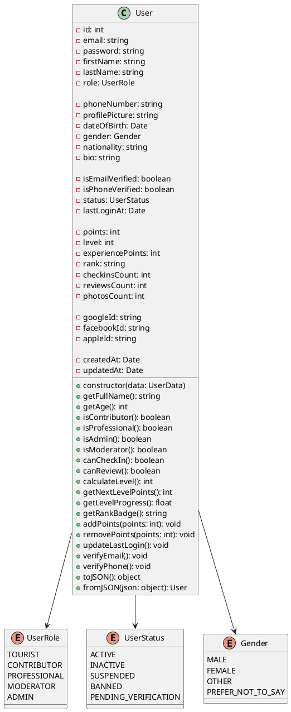

---

## 2. Classe TouristSite

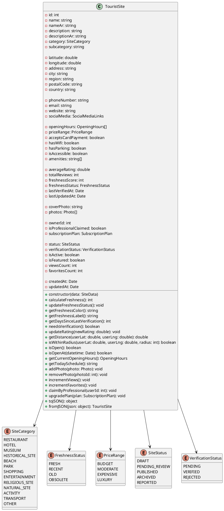

---

## 3. Classe CheckIn

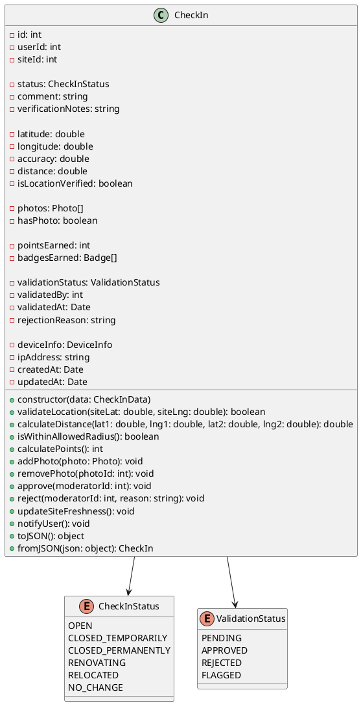

---

## 4. Classe Review

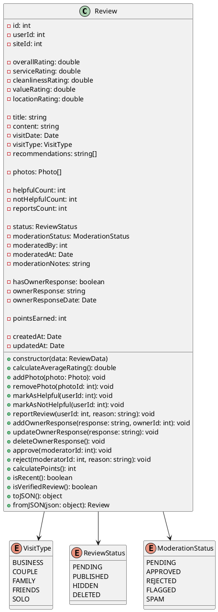

---

## 5. Classe Badge

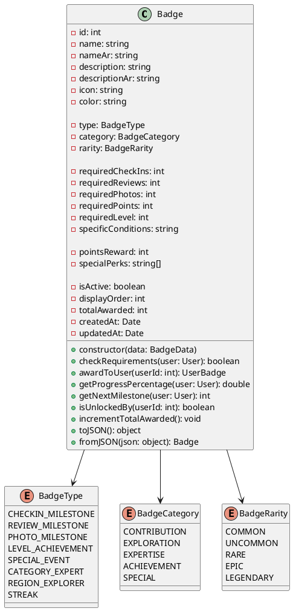

---

## 6. Classe UserBadge

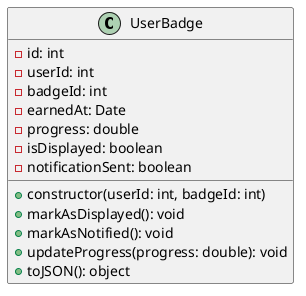

---

## 7. Classe Subscription

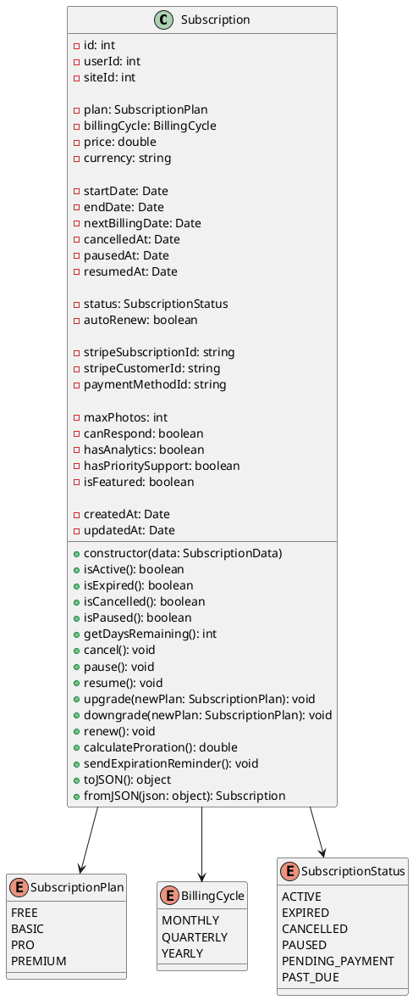

---

## 8. Classe Payment

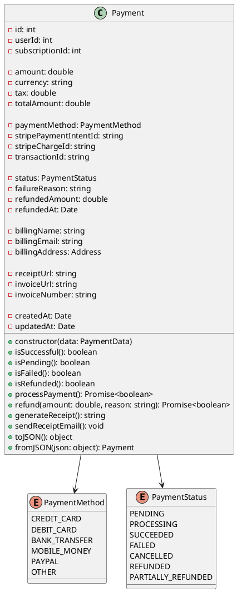

---

## 9. Classe Photo

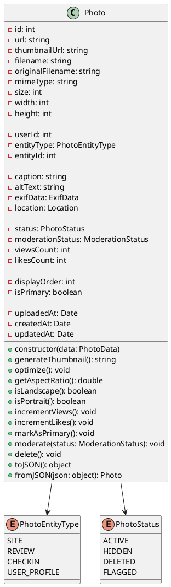

---

## 10. Classe Notification

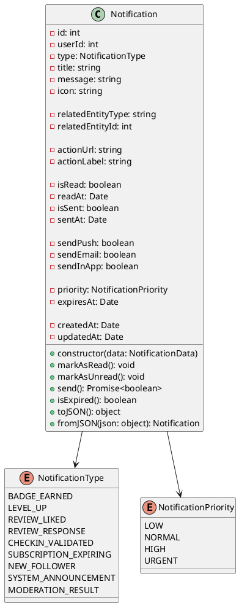

---

## 11. Services Backend

### 11.1 AuthService

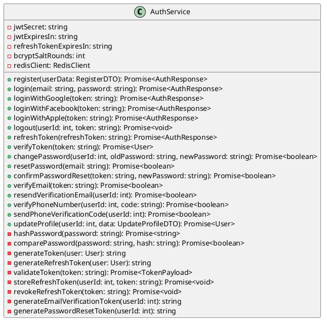

### 11.2 SiteService

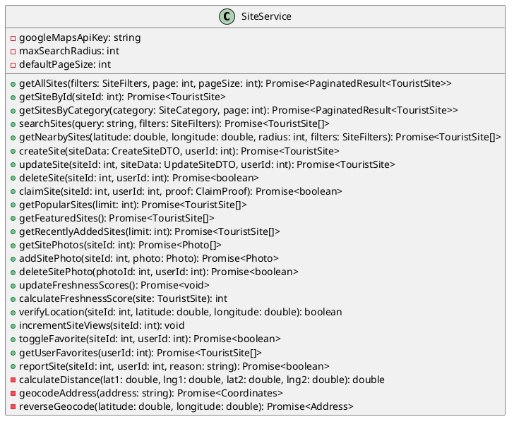

### 11.3 CheckInService

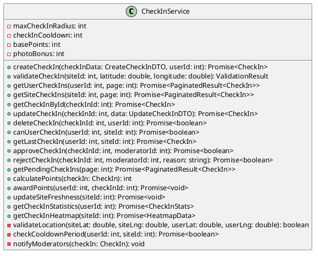

### 11.4 GamificationService

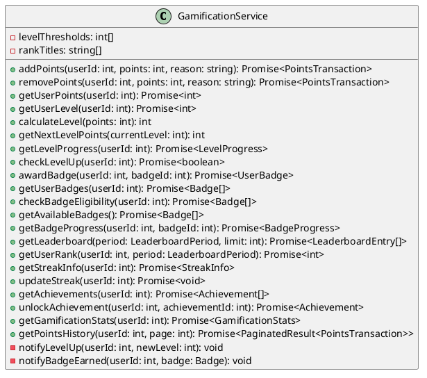

---

## 12. Controllers Backend

### 12.1 AuthController

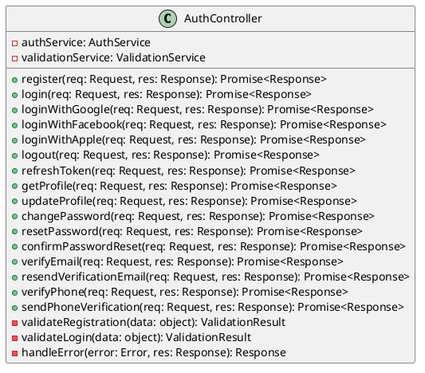

### 12.2 SiteController

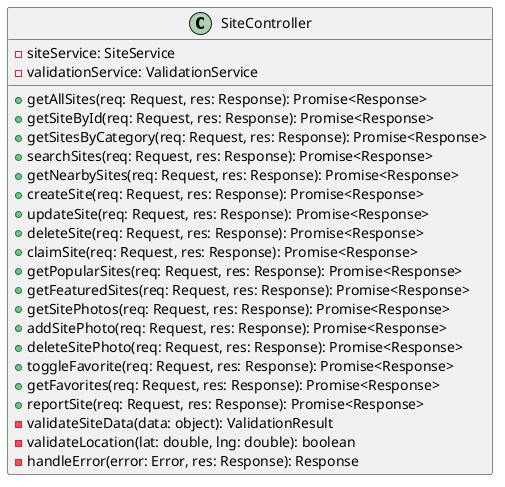

---

## 13. Providers Flutter

### 13.1 AuthProvider

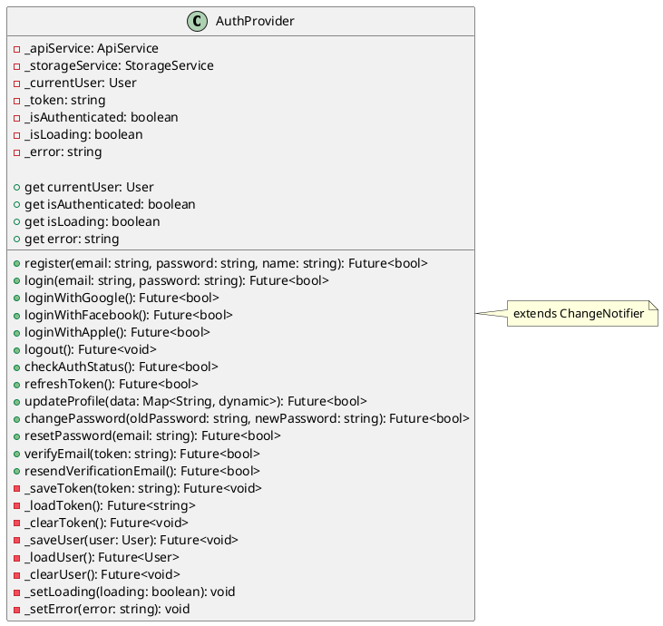

### 13.2 SitesProvider

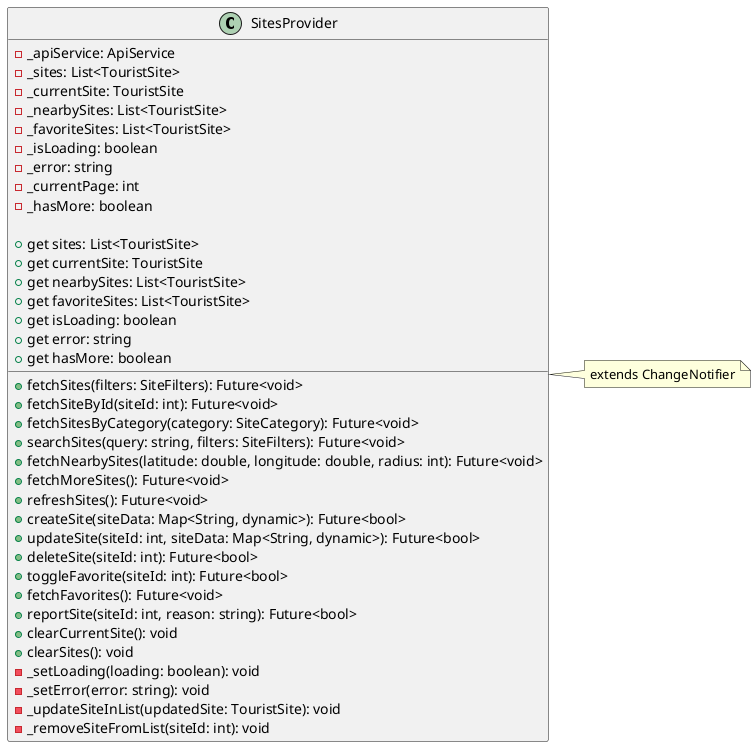

### 13.3 MapProvider

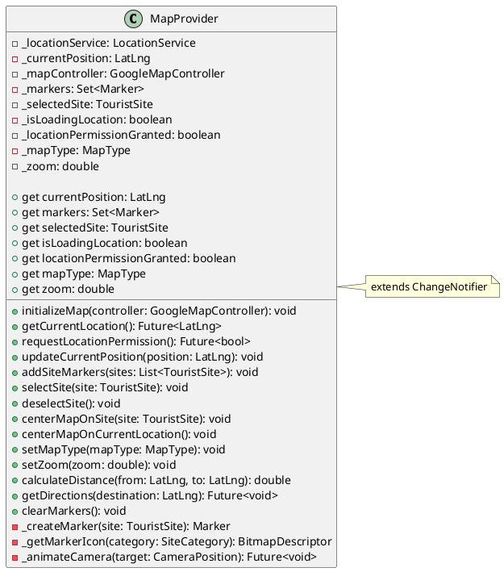

### 13.4 GamificationProvider

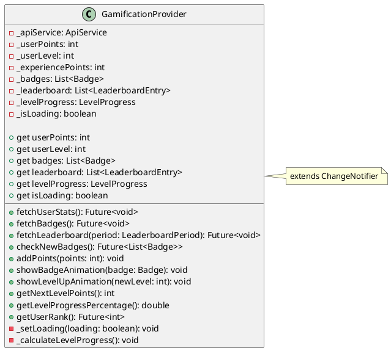

---

## 14. Diagramme de Relations Complet

```plantuml
@startuml RelationsCompletes

' Entities
class User {
  - id: int
  - email: string
  - role: UserRole
  - points: int
  - level: int
}

class TouristSite {
  - id: int
  - name: string
  - latitude: double
  - longitude: double
  - freshnessScore: int
}

class CheckIn {
  - id: int
  - userId: int
  - siteId: int
  - status: CheckInStatus
  - pointsEarned: int
}

class Review {
  - id: int
  - userId: int
  - siteId: int
  - overallRating: double
  - content: string
}

class Badge {
  - id: int
  - name: string
  - type: BadgeType
  - pointsReward: int
}

class UserBadge {
  - userId: int
  - badgeId: int
  - earnedAt: Date
}

class Subscription {
  - id: int
  - userId: int
  - plan: SubscriptionPlan
  - status: SubscriptionStatus
}

class Payment {
  - id: int
  - userId: int
  - subscriptionId: int
  - amount: double
  - status: PaymentStatus
}

class Photo {
  - id: int
  - url: string
  - entityType: PhotoEntityType
  - entityId: int
}

class Notification {
  - id: int
  - userId: int
  - type: NotificationType
  - message: string
}

' Relations
User "1" -- "0..*" CheckIn : creates >
User "1" -- "0..*" Review : writes >
User "0..*" -- "0..*" Badge : earns >
(User, Badge) .. UserBadge

TouristSite "1" -- "0..*" CheckIn : has >
TouristSite "1" -- "0..*" Review : has >
TouristSite "1" -- "0..*" Photo : contains >

CheckIn "1" -- "0..*" Photo : includes >
Review "1" -- "0..*" Photo : includes >

User "1" -- "0..*" Subscription : subscribes >
Subscription "1" -- "0..*" Payment : requires >

User "1" -- "0..*" Notification : receives >
User "1" -- "0..*" Photo : uploads >

TouristSite "0..1" -- "1" User : owned by >

@enduml
```

---

## 15. Diagramme d'Architecture Complète

```plantuml
@startuml ArchitectureComplete

package "Frontend - Flutter" {
  [Screens] as screens
  [Widgets] as widgets
  [Providers] as providers
  [Services] as fservices
  [Models] as fmodels
}

package "Backend - Node.js" {
  package "Routes Layer" {
    [Express Router] as router
  }
  
  package "Controllers Layer" {
    [AuthController] as authController
    [SiteController] as siteController
    [CheckInController] as checkinController
    [ReviewController] as reviewController
  }
  
  package "Services Layer" {
    [AuthService] as authService
    [SiteService] as siteService
    [CheckInService] as checkinService
    [ReviewService] as reviewService
    [GamificationService] as gamificationService
  }
  
  package "Models Layer" {
    [User] as userModel
    [TouristSite] as siteModel
    [CheckIn] as checkinModel
    [Review] as reviewModel
  }
}

package "Database" {
  database "MySQL" as mysql
  database "Redis" as redis
}

package "External Services" {
  [Google Maps API] as gmaps
  [Stripe] as stripe
  [AWS S3] as s3
  [Firebase] as firebase
}

' Frontend connections
screens --> providers
screens --> widgets
providers --> fservices
providers --> fmodels
fservices --> router : HTTP/REST

' Backend connections
router --> authController
router --> siteController
router --> checkinController
router --> reviewController

authController --> authService
siteController --> siteService
checkinController --> checkinService
reviewController --> reviewService

authService --> userModel
siteService --> siteModel
checkinService --> checkinModel
reviewService --> reviewModel

checkinService --> gamificationService
reviewService --> gamificationService

userModel --> mysql
siteModel --> mysql
checkinModel --> mysql
reviewModel --> mysql

authService --> redis
authService --> firebase

siteService --> gmaps
siteService --> s3
authService --> stripe

@enduml
```

---

## 16. Diagramme de Packages

```plantuml
@startuml Packages

package "MoroccoCheck Backend" {
  
  package "api" {
    package "controllers" {
      class AuthController
      class SiteController
      class CheckInController
      class ReviewController
      class SubscriptionController
    }
    
    package "middlewares" {
      class AuthMiddleware
      class ValidationMiddleware
      class RateLimitMiddleware
    }
    
    package "routes" {
      class AuthRoutes
      class SiteRoutes
      class CheckInRoutes
      class ReviewRoutes
    }
  }
  
  package "services" {
    class AuthService
    class SiteService
    class CheckInService
    class ReviewService
    class GamificationService
    class PaymentService
    class NotificationService
    class StorageService
  }
  
  package "models" {
    class User
    class TouristSite
    class CheckIn
    class Review
    class Badge
    class Subscription
    class Payment
  }
  
  package "database" {
    class DatabaseConnection
    class UserRepository
    class SiteRepository
    class CheckInRepository
  }
  
  package "utils" {
    class Validator
    class Logger
    class EmailSender
    class FileUploader
  }
}

controllers ..> services : uses
services ..> models : uses
services ..> database : uses
controllers ..> middlewares : protected by
routes ..> controllers : calls
database ..> models : manages

@enduml
```

---

## Instructions d'utilisation

### Pour générer les diagrammes :

1. **En ligne** :
   - Allez sur http://www.plantuml.com/plantuml/
   - Copiez-collez le code UML
   - Cliquez sur "Submit" pour générer le diagramme

2. **VS Code** :
   - Installez l'extension "PlantUML"
   - Créez un fichier `.puml`
   - Collez le code
   - Faites Alt+D pour prévisualiser

3. **IntelliJ IDEA / PyCharm** :
   - Installez le plugin "PlantUML integration"
   - Créez un fichier `.puml`
   - Le diagramme s'affiche automatiquement

4. **CLI** :
   ```bash
   # Installer PlantUML
   brew install plantuml  # macOS
   sudo apt-get install plantuml  # Linux
   
   # Générer le diagramme
   plantuml diagram.puml
   ```

### Formats de sortie disponibles :
- PNG
- SVG
- PDF
- EPS
- LaTeX

---

**Document créé le 16 janvier 2026**  
**MoroccoCheck - Codes Source UML PlantUML**  
**Version 1.0**
