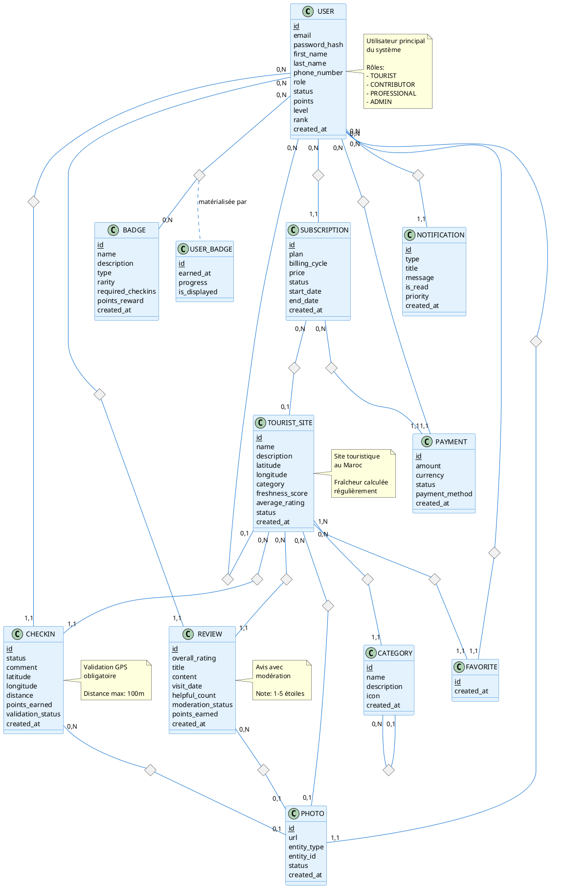

# Phase 2.1 : Modèle Conceptuel de Données (MCD)
## MoroccoCheck - Application Mobile Touristique

*Document créé le 16 janvier 2026*

---

## Table des Matières

1. [Introduction](#1-introduction)
2. [Entités Principales](#2-entités-principales)
3. [Relations et Cardinalités](#3-relations-et-cardinalités)
4. [Diagramme Entité-Association Complet](#4-diagramme-entité-association-complet)
5. [Règles de Gestion](#5-règles-de-gestion)
6. [Dictionnaire des Entités](#6-dictionnaire-des-entités)

---

## 1. Introduction

### 1.1 Objectif du MCD

Le Modèle Conceptuel de Données (MCD) définit la structure des données de MoroccoCheck de manière **indépendante de toute considération technique**. Il représente :

- Les **entités** (objets métier)
- Les **attributs** de chaque entité
- Les **relations** entre entités
- Les **cardinalités** des relations

### 1.2 Méthodologie

Le MCD suit la notation **Merise** et utilise les conventions suivantes :

- **Rectangle** : Entité
- **Ellipse** : Relation
- **Cardinalités** : (min, max) de chaque côté de la relation
- **Attributs** : Listés dans chaque entité
- **Identifiant** : Souligné

---

## 2. Entités Principales

### 2.1 USER (Utilisateur)

**Description** : Représente un utilisateur de l'application (touriste, contributeur, professionnel, admin).

**Attributs** :
- `id` (Identifiant unique) **[PK]**
- `email` (Adresse email)
- `password_hash` (Mot de passe hashé)
- `first_name` (Prénom)
- `last_name` (Nom)
- `phone_number` (Numéro de téléphone)
- `date_of_birth` (Date de naissance)
- `gender` (Genre)
- `nationality` (Nationalité)
- `profile_picture` (Photo de profil)
- `bio` (Biographie)
- `role` (Rôle : TOURIST, CONTRIBUTOR, PROFESSIONAL, ADMIN)
- `status` (Statut : ACTIVE, INACTIVE, SUSPENDED, BANNED)
- `is_email_verified` (Email vérifié)
- `is_phone_verified` (Téléphone vérifié)
- `points` (Points de gamification)
- `level` (Niveau)
- `experience_points` (Points d'expérience)
- `rank` (Rang : Bronze, Silver, Gold, Platinum)
- `checkins_count` (Nombre de check-ins)
- `reviews_count` (Nombre d'avis)
- `photos_count` (Nombre de photos)
- `google_id` (ID Google OAuth)
- `facebook_id` (ID Facebook OAuth)
- `apple_id` (ID Apple OAuth)
- `last_login_at` (Dernière connexion)
- `created_at` (Date de création)
- `updated_at` (Date de mise à jour)

---

### 2.2 TOURIST_SITE (Site Touristique)

**Description** : Représente un lieu touristique au Maroc (restaurant, hôtel, monument, etc.).

**Attributs** :
- `id` (Identifiant unique) **[PK]**
- `name` (Nom du site)
- `name_ar` (Nom en arabe)
- `description` (Description)
- `description_ar` (Description en arabe)
- `category` (Catégorie : RESTAURANT, HOTEL, MUSEUM, etc.)
- `subcategory` (Sous-catégorie)
- `latitude` (Latitude GPS)
- `longitude` (Longitude GPS)
- `address` (Adresse complète)
- `city` (Ville)
- `region` (Région)
- `postal_code` (Code postal)
- `country` (Pays)
- `phone_number` (Téléphone)
- `email` (Email)
- `website` (Site web)
- `social_media` (Réseaux sociaux JSON)
- `opening_hours` (Horaires d'ouverture JSON)
- `price_range` (Gamme de prix)
- `accepts_card_payment` (Accepte carte)
- `has_wifi` (WiFi disponible)
- `has_parking` (Parking disponible)
- `is_accessible` (Accessible PMR)
- `amenities` (Équipements JSON)
- `average_rating` (Note moyenne)
- `total_reviews` (Nombre total d'avis)
- `freshness_score` (Score de fraîcheur 0-100)
- `freshness_status` (Statut : FRESH, RECENT, OLD, OBSOLETE)
- `last_verified_at` (Dernière vérification)
- `last_updated_at` (Dernière mise à jour)
- `cover_photo` (Photo de couverture)
- `owner_id` (Propriétaire professionnel) **[FK → USER]**
- `is_professional_claimed` (Réclamé par professionnel)
- `subscription_plan` (Plan d'abonnement)
- `status` (Statut : DRAFT, PENDING, PUBLISHED, ARCHIVED)
- `verification_status` (Statut vérification)
- `is_active` (Actif)
- `is_featured` (En vedette)
- `views_count` (Nombre de vues)
- `favorites_count` (Nombre de favoris)
- `created_at` (Date de création)
- `updated_at` (Date de mise à jour)

---

### 2.3 CHECKIN (Check-in)

**Description** : Enregistrement de la présence d'un utilisateur sur un site avec validation GPS.

**Attributs** :
- `id` (Identifiant unique) **[PK]**
- `user_id` (Utilisateur) **[FK → USER]**
- `site_id` (Site touristique) **[FK → TOURIST_SITE]**
- `status` (Statut du site : OPEN, CLOSED_TEMPORARILY, etc.)
- `comment` (Commentaire)
- `verification_notes` (Notes de vérification)
- `latitude` (Latitude GPS utilisateur)
- `longitude` (Longitude GPS utilisateur)
- `accuracy` (Précision GPS en mètres)
- `distance` (Distance du site en mètres)
- `is_location_verified` (Localisation vérifiée)
- `has_photo` (A une photo)
- `points_earned` (Points gagnés)
- `validation_status` (Statut : PENDING, APPROVED, REJECTED, FLAGGED)
- `validated_by` (Validé par) **[FK → USER]**
- `validated_at` (Date de validation)
- `rejection_reason` (Raison du rejet)
- `device_info` (Informations appareil JSON)
- `ip_address` (Adresse IP)
- `created_at` (Date de création)
- `updated_at` (Date de mise à jour)

---

### 2.4 REVIEW (Avis)

**Description** : Avis laissé par un utilisateur sur un site touristique.

**Attributs** :
- `id` (Identifiant unique) **[PK]**
- `user_id` (Utilisateur) **[FK → USER]**
- `site_id` (Site touristique) **[FK → TOURIST_SITE]**
- `overall_rating` (Note globale 1-5)
- `service_rating` (Note service 1-5)
- `cleanliness_rating` (Note propreté 1-5)
- `value_rating` (Note rapport qualité/prix 1-5)
- `location_rating` (Note emplacement 1-5)
- `title` (Titre de l'avis)
- `content` (Contenu de l'avis)
- `visit_date` (Date de visite)
- `visit_type` (Type de visite : BUSINESS, COUPLE, FAMILY, etc.)
- `recommendations` (Recommandations JSON)
- `helpful_count` (Nombre de votes "utile")
- `not_helpful_count` (Nombre de votes "pas utile")
- `reports_count` (Nombre de signalements)
- `status` (Statut : PENDING, PUBLISHED, HIDDEN, DELETED)
- `moderation_status` (Statut modération : PENDING, APPROVED, REJECTED, SPAM)
- `moderated_by` (Modéré par) **[FK → USER]**
- `moderated_at` (Date de modération)
- `moderation_notes` (Notes de modération)
- `has_owner_response` (A une réponse du propriétaire)
- `owner_response` (Réponse du propriétaire)
- `owner_response_date` (Date de réponse)
- `points_earned` (Points gagnés)
- `created_at` (Date de création)
- `updated_at` (Date de mise à jour)

---

### 2.5 BADGE (Badge)

**Description** : Badge de gamification pouvant être débloqué par les utilisateurs.

**Attributs** :
- `id` (Identifiant unique) **[PK]**
- `name` (Nom du badge)
- `name_ar` (Nom en arabe)
- `description` (Description)
- `description_ar` (Description en arabe)
- `icon` (URL de l'icône)
- `color` (Couleur)
- `type` (Type : CHECKIN_MILESTONE, REVIEW_MILESTONE, etc.)
- `category` (Catégorie : CONTRIBUTION, EXPLORATION, etc.)
- `rarity` (Rareté : COMMON, RARE, EPIC, LEGENDARY)
- `required_checkins` (Check-ins requis)
- `required_reviews` (Avis requis)
- `required_photos` (Photos requises)
- `required_points` (Points requis)
- `required_level` (Niveau requis)
- `specific_conditions` (Conditions spécifiques JSON)
- `points_reward` (Points récompense)
- `special_perks` (Avantages spéciaux JSON)
- `is_active` (Actif)
- `display_order` (Ordre d'affichage)
- `total_awarded` (Total attribué)
- `created_at` (Date de création)
- `updated_at` (Date de mise à jour)

---

### 2.6 USER_BADGE (Association User-Badge)

**Description** : Table de liaison entre utilisateurs et badges (relation N:M).

**Attributs** :
- `id` (Identifiant unique) **[PK]**
- `user_id` (Utilisateur) **[FK → USER]**
- `badge_id` (Badge) **[FK → BADGE]**
- `earned_at` (Date d'obtention)
- `progress` (Progression vers le badge)
- `is_displayed` (Affiché sur le profil)
- `notification_sent` (Notification envoyée)

---

### 2.7 SUBSCRIPTION (Abonnement)

**Description** : Abonnement professionnel pour gérer un site touristique.

**Attributs** :
- `id` (Identifiant unique) **[PK]**
- `user_id` (Utilisateur) **[FK → USER]**
- `site_id` (Site touristique) **[FK → TOURIST_SITE]**
- `plan` (Plan : FREE, BASIC, PRO, PREMIUM)
- `billing_cycle` (Cycle : MONTHLY, QUARTERLY, YEARLY)
- `price` (Prix)
- `currency` (Devise)
- `start_date` (Date de début)
- `end_date` (Date de fin)
- `next_billing_date` (Prochaine facturation)
- `cancelled_at` (Date d'annulation)
- `paused_at` (Date de mise en pause)
- `resumed_at` (Date de reprise)
- `status` (Statut : ACTIVE, EXPIRED, CANCELLED, PAUSED, PAST_DUE)
- `auto_renew` (Renouvellement automatique)
- `stripe_subscription_id` (ID Stripe)
- `stripe_customer_id` (ID client Stripe)
- `payment_method_id` (Méthode de paiement)
- `max_photos` (Nombre max de photos)
- `can_respond` (Peut répondre aux avis)
- `has_analytics` (Accès analytics)
- `has_priority_support` (Support prioritaire)
- `is_featured` (En vedette)
- `created_at` (Date de création)
- `updated_at` (Date de mise à jour)

---

### 2.8 PAYMENT (Paiement)

**Description** : Enregistrement d'un paiement pour un abonnement.

**Attributs** :
- `id` (Identifiant unique) **[PK]**
- `user_id` (Utilisateur) **[FK → USER]**
- `subscription_id` (Abonnement) **[FK → SUBSCRIPTION]**
- `amount` (Montant)
- `currency` (Devise)
- `tax` (Taxe)
- `total_amount` (Montant total)
- `payment_method` (Méthode : CREDIT_CARD, DEBIT_CARD, etc.)
- `stripe_payment_intent_id` (ID Payment Intent Stripe)
- `stripe_charge_id` (ID Charge Stripe)
- `transaction_id` (ID de transaction)
- `status` (Statut : PENDING, SUCCEEDED, FAILED, REFUNDED)
- `failure_reason` (Raison de l'échec)
- `refunded_amount` (Montant remboursé)
- `refunded_at` (Date de remboursement)
- `billing_name` (Nom de facturation)
- `billing_email` (Email de facturation)
- `billing_address` (Adresse de facturation JSON)
- `receipt_url` (URL du reçu)
- `invoice_url` (URL de la facture)
- `invoice_number` (Numéro de facture)
- `created_at` (Date de création)
- `updated_at` (Date de mise à jour)

---

### 2.9 PHOTO (Photo)

**Description** : Photo associée à un site, un check-in ou un avis.

**Attributs** :
- `id` (Identifiant unique) **[PK]**
- `url` (URL de la photo)
- `thumbnail_url` (URL miniature)
- `filename` (Nom du fichier)
- `original_filename` (Nom original)
- `mime_type` (Type MIME)
- `size` (Taille en octets)
- `width` (Largeur en pixels)
- `height` (Hauteur en pixels)
- `user_id` (Utilisateur) **[FK → USER]**
- `entity_type` (Type d'entité : SITE, REVIEW, CHECKIN, USER_PROFILE)
- `entity_id` (ID de l'entité)
- `caption` (Légende)
- `alt_text` (Texte alternatif)
- `exif_data` (Données EXIF JSON)
- `location` (Localisation GPS JSON)
- `status` (Statut : ACTIVE, HIDDEN, DELETED, FLAGGED)
- `moderation_status` (Statut modération)
- `views_count` (Nombre de vues)
- `likes_count` (Nombre de likes)
- `display_order` (Ordre d'affichage)
- `is_primary` (Photo principale)
- `uploaded_at` (Date d'upload)
- `created_at` (Date de création)
- `updated_at` (Date de mise à jour)

---

### 2.10 NOTIFICATION (Notification)

**Description** : Notification envoyée à un utilisateur.

**Attributs** :
- `id` (Identifiant unique) **[PK]**
- `user_id` (Utilisateur) **[FK → USER]**
- `type` (Type : BADGE_EARNED, LEVEL_UP, REVIEW_RESPONSE, etc.)
- `title` (Titre)
- `message` (Message)
- `icon` (Icône)
- `related_entity_type` (Type d'entité liée)
- `related_entity_id` (ID de l'entité liée)
- `action_url` (URL d'action)
- `action_label` (Label du bouton)
- `is_read` (Lu)
- `read_at` (Date de lecture)
- `is_sent` (Envoyé)
- `sent_at` (Date d'envoi)
- `send_push` (Envoyer push)
- `send_email` (Envoyer email)
- `send_in_app` (Envoyer in-app)
- `priority` (Priorité : LOW, NORMAL, HIGH, URGENT)
- `expires_at` (Date d'expiration)
- `created_at` (Date de création)
- `updated_at` (Date de mise à jour)

---

### 2.11 CATEGORY (Catégorie)

**Description** : Catégorie de site touristique.

**Attributs** :
- `id` (Identifiant unique) **[PK]**
- `name` (Nom)
- `name_ar` (Nom en arabe)
- `description` (Description)
- `icon` (Icône)
- `color` (Couleur)
- `parent_id` (Catégorie parente) **[FK → CATEGORY]**
- `display_order` (Ordre d'affichage)
- `is_active` (Active)
- `created_at` (Date de création)
- `updated_at` (Date de mise à jour)

---

### 2.12 FAVORITE (Favori)

**Description** : Liste des sites favoris d'un utilisateur.

**Attributs** :
- `id` (Identifiant unique) **[PK]**
- `user_id` (Utilisateur) **[FK → USER]**
- `site_id` (Site touristique) **[FK → TOURIST_SITE]**
- `created_at` (Date d'ajout)

---

## 3. Relations et Cardinalités

### 3.1 Relations Principales

#### R1 : USER -- EFFECTUE --> CHECKIN
- **Cardinalité** : (0,N) côté USER, (1,1) côté CHECKIN
- **Signification** : Un utilisateur peut effectuer 0 ou plusieurs check-ins, un check-in est effectué par exactement 1 utilisateur

#### R2 : USER -- ÉCRIT --> REVIEW
- **Cardinalité** : (0,N) côté USER, (1,1) côté REVIEW
- **Signification** : Un utilisateur peut écrire 0 ou plusieurs avis, un avis est écrit par exactement 1 utilisateur

#### R3 : USER -- OBTIENT --> BADGE (via USER_BADGE)
- **Cardinalité** : (0,N) côté USER, (0,N) côté BADGE
- **Signification** : Un utilisateur peut obtenir 0 ou plusieurs badges, un badge peut être obtenu par 0 ou plusieurs utilisateurs

#### R4 : USER -- POSSÈDE --> SUBSCRIPTION
- **Cardinalité** : (0,N) côté USER, (1,1) côté SUBSCRIPTION
- **Signification** : Un utilisateur peut avoir 0 ou plusieurs abonnements, un abonnement appartient à exactement 1 utilisateur

#### R5 : USER -- EFFECTUE --> PAYMENT
- **Cardinalité** : (0,N) côté USER, (1,1) côté PAYMENT
- **Signification** : Un utilisateur peut effectuer 0 ou plusieurs paiements, un paiement est effectué par exactement 1 utilisateur

#### R6 : USER -- UPLOAD --> PHOTO
- **Cardinalité** : (0,N) côté USER, (1,1) côté PHOTO
- **Signification** : Un utilisateur peut uploader 0 ou plusieurs photos, une photo est uploadée par exactement 1 utilisateur

#### R7 : USER -- REÇOIT --> NOTIFICATION
- **Cardinalité** : (0,N) côté USER, (1,1) côté NOTIFICATION
- **Signification** : Un utilisateur peut recevoir 0 ou plusieurs notifications, une notification est destinée à exactement 1 utilisateur

#### R8 : USER -- AJOUTE_FAVORI --> FAVORITE
- **Cardinalité** : (0,N) côté USER, (1,1) côté FAVORITE
- **Signification** : Un utilisateur peut avoir 0 ou plusieurs favoris

#### R9 : TOURIST_SITE -- REÇOIT --> CHECKIN
- **Cardinalité** : (0,N) côté TOURIST_SITE, (1,1) côté CHECKIN
- **Signification** : Un site peut recevoir 0 ou plusieurs check-ins, un check-in concerne exactement 1 site

#### R10 : TOURIST_SITE -- REÇOIT --> REVIEW
- **Cardinalité** : (0,N) côté TOURIST_SITE, (1,1) côté REVIEW
- **Signification** : Un site peut recevoir 0 ou plusieurs avis, un avis concerne exactement 1 site

#### R11 : TOURIST_SITE -- CONTIENT --> PHOTO
- **Cardinalité** : (0,N) côté TOURIST_SITE, (0,1) côté PHOTO
- **Signification** : Un site peut contenir 0 ou plusieurs photos, une photo peut être associée à 0 ou 1 site

#### R12 : TOURIST_SITE -- EST_DANS --> CATEGORY
- **Cardinalité** : (1,N) côté TOURIST_SITE, (1,1) côté CATEGORY
- **Signification** : Un site appartient à exactement 1 catégorie, une catégorie peut contenir 1 ou plusieurs sites

#### R13 : TOURIST_SITE -- EST_FAVORI_DE --> FAVORITE
- **Cardinalité** : (0,N) côté TOURIST_SITE, (1,1) côté FAVORITE
- **Signification** : Un site peut être favori de 0 ou plusieurs utilisateurs

#### R14 : TOURIST_SITE -- A_PROPRIÉTAIRE --> USER
- **Cardinalité** : (0,1) côté TOURIST_SITE, (0,N) côté USER
- **Signification** : Un site peut avoir 0 ou 1 propriétaire, un utilisateur professionnel peut posséder 0 ou plusieurs sites

#### R15 : SUBSCRIPTION -- CONCERNE --> TOURIST_SITE
- **Cardinalité** : (0,N) côté SUBSCRIPTION, (0,1) côté TOURIST_SITE
- **Signification** : Un abonnement peut concerner 0 ou 1 site, un site peut avoir 0 ou plusieurs abonnements (historique)

#### R16 : SUBSCRIPTION -- GÉNÈRE --> PAYMENT
- **Cardinalité** : (0,N) côté SUBSCRIPTION, (1,1) côté PAYMENT
- **Signification** : Un abonnement peut générer 0 ou plusieurs paiements, un paiement est lié à exactement 1 abonnement

#### R17 : REVIEW -- CONTIENT --> PHOTO
- **Cardinalité** : (0,N) côté REVIEW, (0,1) côté PHOTO
- **Signification** : Un avis peut contenir 0 ou plusieurs photos

#### R18 : CHECKIN -- CONTIENT --> PHOTO
- **Cardinalité** : (0,N) côté CHECKIN, (0,1) côté PHOTO
- **Signification** : Un check-in peut contenir 0 ou plusieurs photos

#### R19 : CATEGORY -- A_SOUS_CATÉGORIE --> CATEGORY
- **Cardinalité** : (0,N) côté CATEGORY (enfant), (0,1) côté CATEGORY (parent)
- **Signification** : Une catégorie peut avoir 0 ou plusieurs sous-catégories, une catégorie peut avoir 0 ou 1 catégorie parente

---

## 4. Diagramme Entité-Association Complet

### 4.1 Code PlantUML - MCD Complet

---

## 5. Règles de Gestion

### 5.1 Règles Métier Générales

**RG1** : Un utilisateur doit avoir un rôle >= CONTRIBUTOR pour effectuer un check-in.

**RG2** : Un utilisateur ne peut effectuer qu'un seul check-in par site et par jour.

**RG3** : Un utilisateur ne peut écrire qu'un seul avis par site touristique.

**RG4** : La distance GPS entre l'utilisateur et le site doit être <= 100m pour valider un check-in.

**RG5** : Un check-in sans photo rapporte 10 points, avec photo rapporte 15 points.

**RG6** : Un avis sans photo rapporte 15 points, avec photo rapporte 20 points (max 50 points pour 10 photos).

**RG7** : Le score de fraîcheur d'un site est calculé toutes les 6 heures.

**RG8** : Un badge est automatiquement attribué dès que toutes ses conditions sont remplies.

**RG9** : Un abonnement professionnel permet de gérer jusqu'à N établissements selon le plan.

**RG10** : Les photos sont modérées automatiquement (Safe Search) puis manuellement si nécessaire.

### 5.2 Règles de Validation

**RV1** : L'email doit être unique dans la table USER.

**RV2** : Le mot de passe doit faire au moins 8 caractères avec au moins 1 chiffre.

**RV3** : Les coordonnées GPS doivent être dans les limites du Maroc (latitude: 27-36, longitude: -13 à -1).

**RV4** : Un avis doit contenir au moins 20 caractères.

**RV5** : Une photo ne peut pas dépasser 5MB.

**RV6** : Un site doit avoir au moins un nom et des coordonnées GPS pour être créé.

### 5.3 Règles de Calcul

**RC1** : Score de fraîcheur = 40% (temps) + 40% (activité) + 20% (avis)

**RC2** : Note moyenne site = SUM(overall_rating) / COUNT(reviews)

**RC3** : Niveau utilisateur = f(points) selon table de seuils prédéfinie

**RC4** : Rang utilisateur = Bronze (<500pts), Silver (500-1000), Gold (1000-5000), Platinum (>5000)

---

## 6. Dictionnaire des Entités

### 6.1 Résumé des Entités

| Entité | Nombre d'attributs | Rôle principal | Relations |
|--------|-------------------|----------------|-----------|
| USER | 28 | Utilisateur du système | 8 relations |
| TOURIST_SITE | 42 | Site touristique | 7 relations |
| CHECKIN | 18 | Vérification GPS | 3 relations |
| REVIEW | 23 | Avis utilisateur | 3 relations |
| BADGE | 18 | Gamification | 1 relation |
| USER_BADGE | 6 | Association User-Badge | 2 relations |
| SUBSCRIPTION | 23 | Abonnement pro | 3 relations |
| PAYMENT | 19 | Paiement | 2 relations |
| PHOTO | 22 | Photo média | 4 relations |
| NOTIFICATION | 19 | Notification | 1 relation |
| CATEGORY | 9 | Catégorie site | 2 relations |
| FAVORITE | 3 | Favori utilisateur | 2 relations |

### 6.2 Statistiques du MCD

- **Total d'entités** : 12
- **Total de relations** : 19
- **Total d'attributs** : 250+
- **Relations N:M** : 1 (USER-BADGE via USER_BADGE)
- **Relations hiérarchiques** : 1 (CATEGORY auto-référence)
- **Relations 1:N** : 17

---

## Conclusion

Le Modèle Conceptuel de Données de MoroccoCheck couvre l'ensemble des besoins fonctionnels identifiés :

✅ Gestion des utilisateurs et gamification
✅ Sites touristiques avec géolocalisation
✅ Check-ins avec validation GPS
✅ Système d'avis et modération
✅ Abonnements professionnels et paiements
✅ Gestion des médias (photos)
✅ Système de notifications
✅ Favoris et catégories

Ce MCD servira de base pour la création du Modèle Logique de Données (MLD) et du Modèle Physique de Données (MPD).

---

**Document créé le 16 janvier 2026**  
**MoroccoCheck - Phase 2.1 : Modèle Conceptuel de Données (MCD)**  
**Version 1.0 - Complet**
