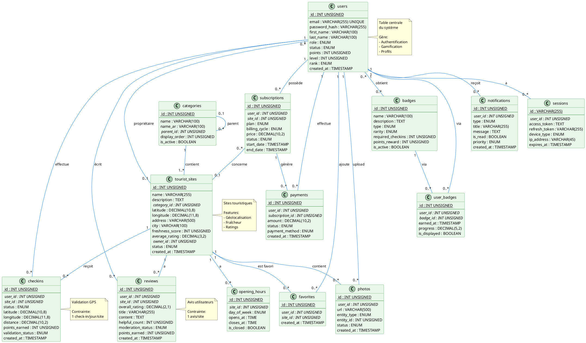

# Phase 2.2 : Modèle Logique de Données (MLD)
## MoroccoCheck - Application Mobile Touristique

*Document créé le 16 janvier 2026*

---

## Table des Matières

1. [Introduction](#1-introduction)
2. [Schéma Relationnel](#2-schéma-relationnel)
3. [Scripts SQL Complets](#3-scripts-sql-complets)
4. [Contraintes d'Intégrité](#4-contraintes-dintégrité)
5. [Index et Optimisations](#5-index-et-optimisations)
6. [Diagramme Relationnel](#6-diagramme-relationnel)

---

## 1. Introduction

### 1.1 Objectif du MLD

Le Modèle Logique de Données (MLD) transforme le MCD en structure **relationnelle** adaptée à MySQL. Il définit :

- Les **tables** avec leurs colonnes et types
- Les **clés primaires** (PRIMARY KEY)
- Les **clés étrangères** (FOREIGN KEY)
- Les **contraintes** (CHECK, UNIQUE, NOT NULL)
- Les **index** pour optimisation

### 1.2 Conventions

- **Nommage** : snake_case (users, tourist_sites)
- **Types** : MySQL 8.0+ (INT, VARCHAR, DECIMAL, TIMESTAMP, ENUM, JSON)
- **Encoding** : UTF8MB4 (support émojis et caractères arabes)
- **Engine** : InnoDB (transactions ACID, clés étrangères)
- **Collation** : utf8mb4_unicode_ci

---

## 2. Schéma Relationnel

### 2.1 Liste des Tables

| # | Table | Description | Lignes estimées |
|---|-------|-------------|-----------------|
| 1 | users | Utilisateurs | 10,000 - 100,000 |
| 2 | tourist_sites | Sites touristiques | 5,000 - 50,000 |
| 3 | checkins | Check-ins GPS | 50,000 - 500,000 |
| 4 | reviews | Avis utilisateurs | 20,000 - 200,000 |
| 5 | badges | Badges gamification | 50 - 100 |
| 6 | user_badges | Association User-Badge | 10,000 - 100,000 |
| 7 | subscriptions | Abonnements pros | 500 - 5,000 |
| 8 | payments | Paiements | 1,000 - 10,000 |
| 9 | photos | Photos média | 50,000 - 500,000 |
| 10 | notifications | Notifications | 100,000 - 1,000,000 |
| 11 | categories | Catégories sites | 20 - 50 |
| 12 | favorites | Favoris utilisateurs | 10,000 - 100,000 |
| 13 | sessions | Sessions utilisateurs | 10,000 - 50,000 |
| 14 | opening_hours | Horaires d'ouverture | 5,000 - 50,000 |

### 2.2 Relations Clés Étrangères

```
users (id) → checkins (user_id)
users (id) → reviews (user_id)
users (id) → user_badges (user_id)
users (id) → subscriptions (user_id)
users (id) → payments (user_id)
users (id) → photos (user_id)
users (id) → notifications (user_id)
users (id) → favorites (user_id)
users (id) → sessions (user_id)

tourist_sites (id) → checkins (site_id)
tourist_sites (id) → reviews (site_id)
tourist_sites (id) → photos (entity_id) [WHERE entity_type='SITE']
tourist_sites (id) → favorites (site_id)
tourist_sites (id) → subscriptions (site_id)
tourist_sites (id) → opening_hours (site_id)
tourist_sites (id) → users (owner_id)

categories (id) → tourist_sites (category_id)
categories (id) → categories (parent_id) [auto-référence]

badges (id) → user_badges (badge_id)

subscriptions (id) → payments (subscription_id)
```

---

## 3. Scripts SQL Complets

### 3.1 Table USERS

```sql
CREATE TABLE users (
    -- Identifiant
    id INT UNSIGNED AUTO_INCREMENT PRIMARY KEY,
    
    -- Authentification
    email VARCHAR(255) NOT NULL UNIQUE,
    password_hash VARCHAR(255) NOT NULL,
    
    -- Informations personnelles
    first_name VARCHAR(100) NOT NULL,
    last_name VARCHAR(100) NOT NULL,
    phone_number VARCHAR(20),
    date_of_birth DATE,
    gender ENUM('MALE', 'FEMALE', 'OTHER', 'PREFER_NOT_TO_SAY'),
    nationality VARCHAR(2), -- Code ISO 3166-1 alpha-2
    profile_picture VARCHAR(500),
    bio TEXT,
    
    -- Rôle et statut
    role ENUM('TOURIST', 'CONTRIBUTOR', 'PROFESSIONAL', 'MODERATOR', 'ADMIN') 
        NOT NULL DEFAULT 'TOURIST',
    status ENUM('ACTIVE', 'INACTIVE', 'SUSPENDED', 'BANNED', 'PENDING_VERIFICATION') 
        NOT NULL DEFAULT 'PENDING_VERIFICATION',
    
    -- Vérification
    is_email_verified BOOLEAN NOT NULL DEFAULT FALSE,
    is_phone_verified BOOLEAN NOT NULL DEFAULT FALSE,
    email_verification_token VARCHAR(255),
    email_verification_expires_at TIMESTAMP NULL,
    
    -- Gamification
    points INT UNSIGNED NOT NULL DEFAULT 0,
    level INT UNSIGNED NOT NULL DEFAULT 1,
    experience_points INT UNSIGNED NOT NULL DEFAULT 0,
    rank ENUM('BRONZE', 'SILVER', 'GOLD', 'PLATINUM') NOT NULL DEFAULT 'BRONZE',
    checkins_count INT UNSIGNED NOT NULL DEFAULT 0,
    reviews_count INT UNSIGNED NOT NULL DEFAULT 0,
    photos_count INT UNSIGNED NOT NULL DEFAULT 0,
    
    -- OAuth
    google_id VARCHAR(255) UNIQUE,
    facebook_id VARCHAR(255) UNIQUE,
    apple_id VARCHAR(255) UNIQUE,
    
    -- Métadonnées
    last_login_at TIMESTAMP NULL,
    last_seen_at TIMESTAMP NULL,
    created_at TIMESTAMP NOT NULL DEFAULT CURRENT_TIMESTAMP,
    updated_at TIMESTAMP NOT NULL DEFAULT CURRENT_TIMESTAMP ON UPDATE CURRENT_TIMESTAMP,
    deleted_at TIMESTAMP NULL,
    
    -- Index
    INDEX idx_email (email),
    INDEX idx_role (role),
    INDEX idx_status (status),
    INDEX idx_points (points DESC),
    INDEX idx_level (level DESC),
    INDEX idx_created_at (created_at),
    INDEX idx_google_id (google_id),
    INDEX idx_facebook_id (facebook_id),
    INDEX idx_apple_id (apple_id)
) ENGINE=InnoDB DEFAULT CHARSET=utf8mb4 COLLATE=utf8mb4_unicode_ci;
```

---

### 3.2 Table CATEGORIES

```sql
CREATE TABLE categories (
    -- Identifiant
    id INT UNSIGNED AUTO_INCREMENT PRIMARY KEY,
    
    -- Informations
    name VARCHAR(100) NOT NULL,
    name_ar VARCHAR(100) NOT NULL,
    description TEXT,
    description_ar TEXT,
    icon VARCHAR(255),
    color VARCHAR(7), -- Hex color (#RRGGBB)
    
    -- Hiérarchie
    parent_id INT UNSIGNED NULL,
    
    -- Affichage
    display_order INT UNSIGNED NOT NULL DEFAULT 0,
    is_active BOOLEAN NOT NULL DEFAULT TRUE,
    
    -- Métadonnées
    created_at TIMESTAMP NOT NULL DEFAULT CURRENT_TIMESTAMP,
    updated_at TIMESTAMP NOT NULL DEFAULT CURRENT_TIMESTAMP ON UPDATE CURRENT_TIMESTAMP,
    
    -- Clé étrangère
    FOREIGN KEY (parent_id) REFERENCES categories(id) 
        ON DELETE SET NULL ON UPDATE CASCADE,
    
    -- Index
    INDEX idx_parent_id (parent_id),
    INDEX idx_display_order (display_order),
    INDEX idx_is_active (is_active)
) ENGINE=InnoDB DEFAULT CHARSET=utf8mb4 COLLATE=utf8mb4_unicode_ci;
```

---

### 3.3 Table TOURIST_SITES

```sql
CREATE TABLE tourist_sites (
    -- Identifiant
    id INT UNSIGNED AUTO_INCREMENT PRIMARY KEY,
    
    -- Informations de base
    name VARCHAR(255) NOT NULL,
    name_ar VARCHAR(255),
    description TEXT,
    description_ar TEXT,
    category_id INT UNSIGNED NOT NULL,
    subcategory VARCHAR(100),
    
    -- Localisation
    latitude DECIMAL(10, 8) NOT NULL,
    longitude DECIMAL(11, 8) NOT NULL,
    address VARCHAR(500),
    city VARCHAR(100),
    region VARCHAR(100),
    postal_code VARCHAR(20),
    country VARCHAR(2) NOT NULL DEFAULT 'MA', -- Code ISO
    
    -- Contact
    phone_number VARCHAR(20),
    email VARCHAR(255),
    website VARCHAR(500),
    social_media JSON, -- {facebook, instagram, twitter, etc}
    
    -- Horaires et prix
    price_range ENUM('BUDGET', 'MODERATE', 'EXPENSIVE', 'LUXURY'),
    
    -- Équipements
    accepts_card_payment BOOLEAN NOT NULL DEFAULT FALSE,
    has_wifi BOOLEAN NOT NULL DEFAULT FALSE,
    has_parking BOOLEAN NOT NULL DEFAULT FALSE,
    is_accessible BOOLEAN NOT NULL DEFAULT FALSE,
    amenities JSON, -- Array of amenities
    
    -- Ratings et fraîcheur
    average_rating DECIMAL(3, 2) NOT NULL DEFAULT 0.00 
        CHECK (average_rating >= 0 AND average_rating <= 5),
    total_reviews INT UNSIGNED NOT NULL DEFAULT 0,
    freshness_score INT UNSIGNED NOT NULL DEFAULT 0 
        CHECK (freshness_score >= 0 AND freshness_score <= 100),
    freshness_status ENUM('FRESH', 'RECENT', 'OLD', 'OBSOLETE') 
        NOT NULL DEFAULT 'OBSOLETE',
    last_verified_at TIMESTAMP NULL,
    last_updated_at TIMESTAMP NULL,
    
    -- Média
    cover_photo VARCHAR(500),
    
    -- Propriétaire professionnel
    owner_id INT UNSIGNED NULL,
    is_professional_claimed BOOLEAN NOT NULL DEFAULT FALSE,
    subscription_plan ENUM('FREE', 'BASIC', 'PRO', 'PREMIUM'),
    
    -- Statut
    status ENUM('DRAFT', 'PENDING_REVIEW', 'PUBLISHED', 'ARCHIVED', 'REPORTED') 
        NOT NULL DEFAULT 'DRAFT',
    verification_status ENUM('PENDING', 'VERIFIED', 'REJECTED') 
        NOT NULL DEFAULT 'PENDING',
    is_active BOOLEAN NOT NULL DEFAULT TRUE,
    is_featured BOOLEAN NOT NULL DEFAULT FALSE,
    
    -- Statistiques
    views_count INT UNSIGNED NOT NULL DEFAULT 0,
    favorites_count INT UNSIGNED NOT NULL DEFAULT 0,
    
    -- Métadonnées
    created_at TIMESTAMP NOT NULL DEFAULT CURRENT_TIMESTAMP,
    updated_at TIMESTAMP NOT NULL DEFAULT CURRENT_TIMESTAMP ON UPDATE CURRENT_TIMESTAMP,
    deleted_at TIMESTAMP NULL,
    
    -- Clés étrangères
    FOREIGN KEY (category_id) REFERENCES categories(id) 
        ON DELETE RESTRICT ON UPDATE CASCADE,
    FOREIGN KEY (owner_id) REFERENCES users(id) 
        ON DELETE SET NULL ON UPDATE CASCADE,
    
    -- Index
    INDEX idx_category_id (category_id),
    INDEX idx_owner_id (owner_id),
    INDEX idx_location (latitude, longitude),
    INDEX idx_city (city),
    INDEX idx_region (region),
    INDEX idx_status (status),
    INDEX idx_is_active (is_active),
    INDEX idx_is_featured (is_featured),
    INDEX idx_freshness_score (freshness_score DESC),
    INDEX idx_average_rating (average_rating DESC),
    INDEX idx_created_at (created_at),
    INDEX idx_freshness_rating (freshness_score DESC, average_rating DESC),
    FULLTEXT INDEX idx_fulltext_search (name, description, address, city)
) ENGINE=InnoDB DEFAULT CHARSET=utf8mb4 COLLATE=utf8mb4_unicode_ci;
```

---

### 3.4 Table OPENING_HOURS

```sql
CREATE TABLE opening_hours (
    -- Identifiant
    id INT UNSIGNED AUTO_INCREMENT PRIMARY KEY,
    
    -- Relation
    site_id INT UNSIGNED NOT NULL,
    
    -- Jour de la semaine
    day_of_week ENUM('MONDAY', 'TUESDAY', 'WEDNESDAY', 'THURSDAY', 
                     'FRIDAY', 'SATURDAY', 'SUNDAY') NOT NULL,
    
    -- Horaires
    opens_at TIME,
    closes_at TIME,
    is_closed BOOLEAN NOT NULL DEFAULT FALSE,
    is_24_hours BOOLEAN NOT NULL DEFAULT FALSE,
    
    -- Notes
    notes VARCHAR(255),
    
    -- Métadonnées
    created_at TIMESTAMP NOT NULL DEFAULT CURRENT_TIMESTAMP,
    updated_at TIMESTAMP NOT NULL DEFAULT CURRENT_TIMESTAMP ON UPDATE CURRENT_TIMESTAMP,
    
    -- Clé étrangère
    FOREIGN KEY (site_id) REFERENCES tourist_sites(id) 
        ON DELETE CASCADE ON UPDATE CASCADE,
    
    -- Index
    INDEX idx_site_id (site_id),
    INDEX idx_day_of_week (day_of_week),
    UNIQUE KEY unique_site_day (site_id, day_of_week)
) ENGINE=InnoDB DEFAULT CHARSET=utf8mb4 COLLATE=utf8mb4_unicode_ci;
```

---

### 3.5 Table CHECKINS

```sql
CREATE TABLE checkins (
    -- Identifiant
    id INT UNSIGNED AUTO_INCREMENT PRIMARY KEY,
    
    -- Relations
    user_id INT UNSIGNED NOT NULL,
    site_id INT UNSIGNED NOT NULL,
    
    -- Statut du site
    status ENUM('OPEN', 'CLOSED_TEMPORARILY', 'CLOSED_PERMANENTLY', 
                'RENOVATING', 'RELOCATED', 'NO_CHANGE') NOT NULL,
    comment TEXT,
    verification_notes TEXT,
    
    -- Localisation GPS
    latitude DECIMAL(10, 8) NOT NULL,
    longitude DECIMAL(11, 8) NOT NULL,
    accuracy DECIMAL(10, 2) NOT NULL, -- En mètres
    distance DECIMAL(10, 2) NOT NULL, -- Distance du site en mètres
    is_location_verified BOOLEAN NOT NULL DEFAULT FALSE,
    
    -- Photo
    has_photo BOOLEAN NOT NULL DEFAULT FALSE,
    
    -- Gamification
    points_earned INT UNSIGNED NOT NULL DEFAULT 10,
    
    -- Validation
    validation_status ENUM('PENDING', 'APPROVED', 'REJECTED', 'FLAGGED') 
        NOT NULL DEFAULT 'PENDING',
    validated_by INT UNSIGNED NULL,
    validated_at TIMESTAMP NULL,
    rejection_reason TEXT,
    
    -- Métadonnées
    device_info JSON, -- {os, model, app_version, etc}
    ip_address VARCHAR(45), -- IPv6 support
    created_at TIMESTAMP NOT NULL DEFAULT CURRENT_TIMESTAMP,
    updated_at TIMESTAMP NOT NULL DEFAULT CURRENT_TIMESTAMP ON UPDATE CURRENT_TIMESTAMP,
    
    -- Clés étrangères
    FOREIGN KEY (user_id) REFERENCES users(id) 
        ON DELETE CASCADE ON UPDATE CASCADE,
    FOREIGN KEY (site_id) REFERENCES tourist_sites(id) 
        ON DELETE CASCADE ON UPDATE CASCADE,
    FOREIGN KEY (validated_by) REFERENCES users(id) 
        ON DELETE SET NULL ON UPDATE CASCADE,
    
    -- Index
    INDEX idx_user_id (user_id),
    INDEX idx_site_id (site_id),
    INDEX idx_validation_status (validation_status),
    INDEX idx_created_at (created_at DESC),
    INDEX idx_user_site (user_id, site_id),
    INDEX idx_site_date (site_id, created_at DESC),
    
    -- Contrainte : 1 check-in par utilisateur par site par jour
    UNIQUE KEY unique_user_site_date (user_id, site_id, DATE(created_at))
) ENGINE=InnoDB DEFAULT CHARSET=utf8mb4 COLLATE=utf8mb4_unicode_ci;
```

---

### 3.6 Table REVIEWS

```sql
CREATE TABLE reviews (
    -- Identifiant
    id INT UNSIGNED AUTO_INCREMENT PRIMARY KEY,
    
    -- Relations
    user_id INT UNSIGNED NOT NULL,
    site_id INT UNSIGNED NOT NULL,
    
    -- Ratings (1-5)
    overall_rating DECIMAL(2, 1) NOT NULL 
        CHECK (overall_rating >= 1.0 AND overall_rating <= 5.0),
    service_rating DECIMAL(2, 1) 
        CHECK (service_rating IS NULL OR (service_rating >= 1.0 AND service_rating <= 5.0)),
    cleanliness_rating DECIMAL(2, 1) 
        CHECK (cleanliness_rating IS NULL OR (cleanliness_rating >= 1.0 AND cleanliness_rating <= 5.0)),
    value_rating DECIMAL(2, 1) 
        CHECK (value_rating IS NULL OR (value_rating >= 1.0 AND value_rating <= 5.0)),
    location_rating DECIMAL(2, 1) 
        CHECK (location_rating IS NULL OR (location_rating >= 1.0 AND location_rating <= 5.0)),
    
    -- Contenu
    title VARCHAR(255),
    content TEXT NOT NULL,
    visit_date DATE,
    visit_type ENUM('BUSINESS', 'COUPLE', 'FAMILY', 'FRIENDS', 'SOLO'),
    recommendations JSON, -- Array of strings
    
    -- Engagement
    helpful_count INT UNSIGNED NOT NULL DEFAULT 0,
    not_helpful_count INT UNSIGNED NOT NULL DEFAULT 0,
    reports_count INT UNSIGNED NOT NULL DEFAULT 0,
    
    -- Modération
    status ENUM('PENDING', 'PUBLISHED', 'HIDDEN', 'DELETED') 
        NOT NULL DEFAULT 'PENDING',
    moderation_status ENUM('PENDING', 'APPROVED', 'REJECTED', 'FLAGGED', 'SPAM') 
        NOT NULL DEFAULT 'PENDING',
    moderated_by INT UNSIGNED NULL,
    moderated_at TIMESTAMP NULL,
    moderation_notes TEXT,
    
    -- Réponse propriétaire
    has_owner_response BOOLEAN NOT NULL DEFAULT FALSE,
    owner_response TEXT,
    owner_response_date TIMESTAMP NULL,
    
    -- Gamification
    points_earned INT UNSIGNED NOT NULL DEFAULT 15,
    
    -- Métadonnées
    created_at TIMESTAMP NOT NULL DEFAULT CURRENT_TIMESTAMP,
    updated_at TIMESTAMP NOT NULL DEFAULT CURRENT_TIMESTAMP ON UPDATE CURRENT_TIMESTAMP,
    deleted_at TIMESTAMP NULL,
    
    -- Clés étrangères
    FOREIGN KEY (user_id) REFERENCES users(id) 
        ON DELETE CASCADE ON UPDATE CASCADE,
    FOREIGN KEY (site_id) REFERENCES tourist_sites(id) 
        ON DELETE CASCADE ON UPDATE CASCADE,
    FOREIGN KEY (moderated_by) REFERENCES users(id) 
        ON DELETE SET NULL ON UPDATE CASCADE,
    
    -- Index
    INDEX idx_user_id (user_id),
    INDEX idx_site_id (site_id),
    INDEX idx_overall_rating (overall_rating),
    INDEX idx_status (status),
    INDEX idx_moderation_status (moderation_status),
    INDEX idx_created_at (created_at DESC),
    INDEX idx_site_rating (site_id, overall_rating DESC),
    INDEX idx_site_date (site_id, created_at DESC),
    
    -- Contrainte : 1 avis par utilisateur par site
    UNIQUE KEY unique_user_site (user_id, site_id)
) ENGINE=InnoDB DEFAULT CHARSET=utf8mb4 COLLATE=utf8mb4_unicode_ci;
```

---

### 3.7 Table BADGES

```sql
CREATE TABLE badges (
    -- Identifiant
    id INT UNSIGNED AUTO_INCREMENT PRIMARY KEY,
    
    -- Informations
    name VARCHAR(100) NOT NULL,
    name_ar VARCHAR(100),
    description TEXT NOT NULL,
    description_ar TEXT,
    icon VARCHAR(500) NOT NULL,
    color VARCHAR(7) NOT NULL, -- Hex color
    
    -- Classification
    type ENUM('CHECKIN_MILESTONE', 'REVIEW_MILESTONE', 'PHOTO_MILESTONE', 
              'LEVEL_ACHIEVEMENT', 'SPECIAL_EVENT', 'CATEGORY_EXPERT', 
              'REGION_EXPLORER', 'STREAK') NOT NULL,
    category ENUM('CONTRIBUTION', 'EXPLORATION', 'EXPERTISE', 
                  'ACHIEVEMENT', 'SPECIAL') NOT NULL,
    rarity ENUM('COMMON', 'UNCOMMON', 'RARE', 'EPIC', 'LEGENDARY') 
        NOT NULL DEFAULT 'COMMON',
    
    -- Conditions
    required_checkins INT UNSIGNED NOT NULL DEFAULT 0,
    required_reviews INT UNSIGNED NOT NULL DEFAULT 0,
    required_photos INT UNSIGNED NOT NULL DEFAULT 0,
    required_points INT UNSIGNED NOT NULL DEFAULT 0,
    required_level INT UNSIGNED NOT NULL DEFAULT 0,
    specific_conditions JSON, -- Conditions complexes
    
    -- Récompenses
    points_reward INT UNSIGNED NOT NULL DEFAULT 0,
    special_perks JSON, -- Array of perks
    
    -- Statut
    is_active BOOLEAN NOT NULL DEFAULT TRUE,
    display_order INT UNSIGNED NOT NULL DEFAULT 0,
    
    -- Statistiques
    total_awarded INT UNSIGNED NOT NULL DEFAULT 0,
    
    -- Métadonnées
    created_at TIMESTAMP NOT NULL DEFAULT CURRENT_TIMESTAMP,
    updated_at TIMESTAMP NOT NULL DEFAULT CURRENT_TIMESTAMP ON UPDATE CURRENT_TIMESTAMP,
    
    -- Index
    INDEX idx_type (type),
    INDEX idx_category (category),
    INDEX idx_rarity (rarity),
    INDEX idx_is_active (is_active),
    INDEX idx_display_order (display_order)
) ENGINE=InnoDB DEFAULT CHARSET=utf8mb4 COLLATE=utf8mb4_unicode_ci;
```

---

### 3.8 Table USER_BADGES

```sql
CREATE TABLE user_badges (
    -- Identifiant
    id INT UNSIGNED AUTO_INCREMENT PRIMARY KEY,
    
    -- Relations
    user_id INT UNSIGNED NOT NULL,
    badge_id INT UNSIGNED NOT NULL,
    
    -- Progression
    earned_at TIMESTAMP NOT NULL DEFAULT CURRENT_TIMESTAMP,
    progress DECIMAL(5, 2) NOT NULL DEFAULT 100.00 
        CHECK (progress >= 0 AND progress <= 100),
    
    -- Affichage
    is_displayed BOOLEAN NOT NULL DEFAULT TRUE,
    notification_sent BOOLEAN NOT NULL DEFAULT FALSE,
    
    -- Clés étrangères
    FOREIGN KEY (user_id) REFERENCES users(id) 
        ON DELETE CASCADE ON UPDATE CASCADE,
    FOREIGN KEY (badge_id) REFERENCES badges(id) 
        ON DELETE CASCADE ON UPDATE CASCADE,
    
    -- Index
    INDEX idx_user_id (user_id),
    INDEX idx_badge_id (badge_id),
    INDEX idx_earned_at (earned_at DESC),
    
    -- Contrainte : 1 badge par utilisateur
    UNIQUE KEY unique_user_badge (user_id, badge_id)
) ENGINE=InnoDB DEFAULT CHARSET=utf8mb4 COLLATE=utf8mb4_unicode_ci;
```

---

### 3.9 Table SUBSCRIPTIONS

```sql
CREATE TABLE subscriptions (
    -- Identifiant
    id INT UNSIGNED AUTO_INCREMENT PRIMARY KEY,
    
    -- Relations
    user_id INT UNSIGNED NOT NULL,
    site_id INT UNSIGNED NULL,
    
    -- Plan
    plan ENUM('FREE', 'BASIC', 'PRO', 'PREMIUM') NOT NULL DEFAULT 'FREE',
    billing_cycle ENUM('MONTHLY', 'QUARTERLY', 'YEARLY') NOT NULL DEFAULT 'MONTHLY',
    price DECIMAL(10, 2) NOT NULL DEFAULT 0.00,
    currency VARCHAR(3) NOT NULL DEFAULT 'MAD',
    
    -- Dates
    start_date TIMESTAMP NOT NULL,
    end_date TIMESTAMP NOT NULL,
    next_billing_date TIMESTAMP NULL,
    cancelled_at TIMESTAMP NULL,
    paused_at TIMESTAMP NULL,
    resumed_at TIMESTAMP NULL,
    
    -- Statut
    status ENUM('ACTIVE', 'EXPIRED', 'CANCELLED', 'PAUSED', 
                'PENDING_PAYMENT', 'PAST_DUE') NOT NULL DEFAULT 'ACTIVE',
    auto_renew BOOLEAN NOT NULL DEFAULT TRUE,
    
    -- Stripe
    stripe_subscription_id VARCHAR(255) UNIQUE,
    stripe_customer_id VARCHAR(255),
    payment_method_id VARCHAR(255),
    
    -- Features
    max_photos INT UNSIGNED NOT NULL DEFAULT 50,
    can_respond BOOLEAN NOT NULL DEFAULT FALSE,
    has_analytics BOOLEAN NOT NULL DEFAULT FALSE,
    has_priority_support BOOLEAN NOT NULL DEFAULT FALSE,
    is_featured BOOLEAN NOT NULL DEFAULT FALSE,
    
    -- Métadonnées
    created_at TIMESTAMP NOT NULL DEFAULT CURRENT_TIMESTAMP,
    updated_at TIMESTAMP NOT NULL DEFAULT CURRENT_TIMESTAMP ON UPDATE CURRENT_TIMESTAMP,
    
    -- Clés étrangères
    FOREIGN KEY (user_id) REFERENCES users(id) 
        ON DELETE CASCADE ON UPDATE CASCADE,
    FOREIGN KEY (site_id) REFERENCES tourist_sites(id) 
        ON DELETE SET NULL ON UPDATE CASCADE,
    
    -- Index
    INDEX idx_user_id (user_id),
    INDEX idx_site_id (site_id),
    INDEX idx_status (status),
    INDEX idx_plan (plan),
    INDEX idx_end_date (end_date),
    INDEX idx_stripe_subscription_id (stripe_subscription_id),
    INDEX idx_stripe_customer_id (stripe_customer_id)
) ENGINE=InnoDB DEFAULT CHARSET=utf8mb4 COLLATE=utf8mb4_unicode_ci;
```

---

### 3.10 Table PAYMENTS

```sql
CREATE TABLE payments (
    -- Identifiant
    id INT UNSIGNED AUTO_INCREMENT PRIMARY KEY,
    
    -- Relations
    user_id INT UNSIGNED NOT NULL,
    subscription_id INT UNSIGNED NOT NULL,
    
    -- Montants
    amount DECIMAL(10, 2) NOT NULL,
    currency VARCHAR(3) NOT NULL DEFAULT 'MAD',
    tax DECIMAL(10, 2) NOT NULL DEFAULT 0.00,
    total_amount DECIMAL(10, 2) NOT NULL,
    
    -- Méthode de paiement
    payment_method ENUM('CREDIT_CARD', 'DEBIT_CARD', 'BANK_TRANSFER', 
                        'MOBILE_MONEY', 'PAYPAL', 'OTHER') NOT NULL,
    
    -- Stripe
    stripe_payment_intent_id VARCHAR(255) UNIQUE,
    stripe_charge_id VARCHAR(255),
    transaction_id VARCHAR(255),
    
    -- Statut
    status ENUM('PENDING', 'PROCESSING', 'SUCCEEDED', 'FAILED', 
                'CANCELLED', 'REFUNDED', 'PARTIALLY_REFUNDED') 
        NOT NULL DEFAULT 'PENDING',
    failure_reason TEXT,
    refunded_amount DECIMAL(10, 2) NOT NULL DEFAULT 0.00,
    refunded_at TIMESTAMP NULL,
    
    -- Facturation
    billing_name VARCHAR(255),
    billing_email VARCHAR(255),
    billing_address JSON,
    
    -- Documents
    receipt_url VARCHAR(500),
    invoice_url VARCHAR(500),
    invoice_number VARCHAR(50),
    
    -- Métadonnées
    created_at TIMESTAMP NOT NULL DEFAULT CURRENT_TIMESTAMP,
    updated_at TIMESTAMP NOT NULL DEFAULT CURRENT_TIMESTAMP ON UPDATE CURRENT_TIMESTAMP,
    
    -- Clés étrangères
    FOREIGN KEY (user_id) REFERENCES users(id) 
        ON DELETE CASCADE ON UPDATE CASCADE,
    FOREIGN KEY (subscription_id) REFERENCES subscriptions(id) 
        ON DELETE CASCADE ON UPDATE CASCADE,
    
    -- Index
    INDEX idx_user_id (user_id),
    INDEX idx_subscription_id (subscription_id),
    INDEX idx_status (status),
    INDEX idx_created_at (created_at DESC),
    INDEX idx_stripe_payment_intent_id (stripe_payment_intent_id)
) ENGINE=InnoDB DEFAULT CHARSET=utf8mb4 COLLATE=utf8mb4_unicode_ci;
```

---

### 3.11 Table PHOTOS

```sql
CREATE TABLE photos (
    -- Identifiant
    id INT UNSIGNED AUTO_INCREMENT PRIMARY KEY,
    
    -- URLs
    url VARCHAR(500) NOT NULL,
    thumbnail_url VARCHAR(500),
    filename VARCHAR(255) NOT NULL,
    original_filename VARCHAR(255),
    
    -- Métadonnées fichier
    mime_type VARCHAR(50) NOT NULL,
    size INT UNSIGNED NOT NULL, -- En octets
    width INT UNSIGNED,
    height INT UNSIGNED,
    
    -- Relations
    user_id INT UNSIGNED NOT NULL,
    entity_type ENUM('SITE', 'REVIEW', 'CHECKIN', 'USER_PROFILE') NOT NULL,
    entity_id INT UNSIGNED NOT NULL,
    
    -- Contenu
    caption TEXT,
    alt_text VARCHAR(255),
    exif_data JSON,
    location JSON, -- {latitude, longitude}
    
    -- Statut
    status ENUM('ACTIVE', 'HIDDEN', 'DELETED', 'FLAGGED') 
        NOT NULL DEFAULT 'ACTIVE',
    moderation_status ENUM('PENDING', 'APPROVED', 'REJECTED') 
        NOT NULL DEFAULT 'PENDING',
    
    -- Statistiques
    views_count INT UNSIGNED NOT NULL DEFAULT 0,
    likes_count INT UNSIGNED NOT NULL DEFAULT 0,
    
    -- Ordre
    display_order INT UNSIGNED NOT NULL DEFAULT 0,
    is_primary BOOLEAN NOT NULL DEFAULT FALSE,
    
    -- Métadonnées
    uploaded_at TIMESTAMP NOT NULL DEFAULT CURRENT_TIMESTAMP,
    created_at TIMESTAMP NOT NULL DEFAULT CURRENT_TIMESTAMP,
    updated_at TIMESTAMP NOT NULL DEFAULT CURRENT_TIMESTAMP ON UPDATE CURRENT_TIMESTAMP,
    
    -- Clés étrangères
    FOREIGN KEY (user_id) REFERENCES users(id) 
        ON DELETE CASCADE ON UPDATE CASCADE,
    
    -- Index
    INDEX idx_user_id (user_id),
    INDEX idx_entity (entity_type, entity_id),
    INDEX idx_status (status),
    INDEX idx_moderation_status (moderation_status),
    INDEX idx_created_at (created_at DESC)
) ENGINE=InnoDB DEFAULT CHARSET=utf8mb4 COLLATE=utf8mb4_unicode_ci;
```

---

### 3.12 Table NOTIFICATIONS

```sql
CREATE TABLE notifications (
    -- Identifiant
    id INT UNSIGNED AUTO_INCREMENT PRIMARY KEY,
    
    -- Relation
    user_id INT UNSIGNED NOT NULL,
    
    -- Type
    type ENUM('BADGE_EARNED', 'LEVEL_UP', 'REVIEW_LIKED', 'REVIEW_RESPONSE', 
              'CHECKIN_VALIDATED', 'SUBSCRIPTION_EXPIRING', 'NEW_FOLLOWER', 
              'SYSTEM_ANNOUNCEMENT', 'MODERATION_RESULT') NOT NULL,
    
    -- Contenu
    title VARCHAR(255) NOT NULL,
    message TEXT NOT NULL,
    icon VARCHAR(255),
    
    -- Entité liée
    related_entity_type VARCHAR(50),
    related_entity_id INT UNSIGNED,
    
    -- Action
    action_url VARCHAR(500),
    action_label VARCHAR(100),
    
    -- Statut
    is_read BOOLEAN NOT NULL DEFAULT FALSE,
    read_at TIMESTAMP NULL,
    is_sent BOOLEAN NOT NULL DEFAULT FALSE,
    sent_at TIMESTAMP NULL,
    
    -- Canaux
    send_push BOOLEAN NOT NULL DEFAULT TRUE,
    send_email BOOLEAN NOT NULL DEFAULT FALSE,
    send_in_app BOOLEAN NOT NULL DEFAULT TRUE,
    
    -- Priorité
    priority ENUM('LOW', 'NORMAL', 'HIGH', 'URGENT') 
        NOT NULL DEFAULT 'NORMAL',
    expires_at TIMESTAMP NULL,
    
    -- Métadonnées
    created_at TIMESTAMP NOT NULL DEFAULT CURRENT_TIMESTAMP,
    updated_at TIMESTAMP NOT NULL DEFAULT CURRENT_TIMESTAMP ON UPDATE CURRENT_TIMESTAMP,
    
    -- Clés étrangères
    FOREIGN KEY (user_id) REFERENCES users(id) 
        ON DELETE CASCADE ON UPDATE CASCADE,
    
    -- Index
    INDEX idx_user_id (user_id),
    INDEX idx_type (type),
    INDEX idx_is_read (is_read),
    INDEX idx_priority (priority),
    INDEX idx_created_at (created_at DESC),
    INDEX idx_user_unread (user_id, is_read, created_at DESC)
) ENGINE=InnoDB DEFAULT CHARSET=utf8mb4 COLLATE=utf8mb4_unicode_ci;
```

---

### 3.13 Table FAVORITES

```sql
CREATE TABLE favorites (
    -- Identifiant
    id INT UNSIGNED AUTO_INCREMENT PRIMARY KEY,
    
    -- Relations
    user_id INT UNSIGNED NOT NULL,
    site_id INT UNSIGNED NOT NULL,
    
    -- Métadonnées
    created_at TIMESTAMP NOT NULL DEFAULT CURRENT_TIMESTAMP,
    
    -- Clés étrangères
    FOREIGN KEY (user_id) REFERENCES users(id) 
        ON DELETE CASCADE ON UPDATE CASCADE,
    FOREIGN KEY (site_id) REFERENCES tourist_sites(id) 
        ON DELETE CASCADE ON UPDATE CASCADE,
    
    -- Index
    INDEX idx_user_id (user_id),
    INDEX idx_site_id (site_id),
    INDEX idx_created_at (created_at DESC),
    
    -- Contrainte : 1 favori par utilisateur par site
    UNIQUE KEY unique_user_site (user_id, site_id)
) ENGINE=InnoDB DEFAULT CHARSET=utf8mb4 COLLATE=utf8mb4_unicode_ci;
```

---

### 3.14 Table SESSIONS

```sql
CREATE TABLE sessions (
    -- Identifiant
    id VARCHAR(255) PRIMARY KEY, -- Session ID
    
    -- Relation
    user_id INT UNSIGNED NOT NULL,
    
    -- Tokens
    access_token TEXT NOT NULL,
    refresh_token VARCHAR(255) UNIQUE NOT NULL,
    
    -- Informations appareil
    device_type ENUM('IOS', 'ANDROID', 'WEB', 'OTHER') NOT NULL,
    device_name VARCHAR(255),
    device_id VARCHAR(255),
    os_version VARCHAR(50),
    app_version VARCHAR(50),
    
    -- Réseau
    ip_address VARCHAR(45) NOT NULL,
    user_agent TEXT,
    
    -- Localisation
    country VARCHAR(2),
    city VARCHAR(100),
    
    -- Statut
    is_active BOOLEAN NOT NULL DEFAULT TRUE,
    last_activity_at TIMESTAMP NOT NULL DEFAULT CURRENT_TIMESTAMP,
    expires_at TIMESTAMP NOT NULL,
    
    -- Métadonnées
    created_at TIMESTAMP NOT NULL DEFAULT CURRENT_TIMESTAMP,
    updated_at TIMESTAMP NOT NULL DEFAULT CURRENT_TIMESTAMP ON UPDATE CURRENT_TIMESTAMP,
    
    -- Clés étrangères
    FOREIGN KEY (user_id) REFERENCES users(id) 
        ON DELETE CASCADE ON UPDATE CASCADE,
    
    -- Index
    INDEX idx_user_id (user_id),
    INDEX idx_refresh_token (refresh_token),
    INDEX idx_is_active (is_active),
    INDEX idx_expires_at (expires_at),
    INDEX idx_last_activity_at (last_activity_at)
) ENGINE=InnoDB DEFAULT CHARSET=utf8mb4 COLLATE=utf8mb4_unicode_ci;
```

---

## 4. Contraintes d'Intégrité

### 4.1 Contraintes CHECK

```sql
-- Users
ALTER TABLE users 
    ADD CONSTRAINT chk_points CHECK (points >= 0),
    ADD CONSTRAINT chk_level CHECK (level >= 1),
    ADD CONSTRAINT chk_phone_number CHECK (phone_number REGEXP '^[+]?[0-9]{8,15}$');

-- Tourist Sites
ALTER TABLE tourist_sites
    ADD CONSTRAINT chk_latitude CHECK (latitude BETWEEN 27.0 AND 36.0),
    ADD CONSTRAINT chk_longitude CHECK (longitude BETWEEN -13.0 AND -1.0),
    ADD CONSTRAINT chk_average_rating CHECK (average_rating BETWEEN 0 AND 5),
    ADD CONSTRAINT chk_freshness_score CHECK (freshness_score BETWEEN 0 AND 100);

-- Reviews
ALTER TABLE reviews
    ADD CONSTRAINT chk_overall_rating CHECK (overall_rating BETWEEN 1.0 AND 5.0),
    ADD CONSTRAINT chk_content_length CHECK (CHAR_LENGTH(content) >= 20);

-- Payments
ALTER TABLE payments
    ADD CONSTRAINT chk_amount CHECK (amount >= 0),
    ADD CONSTRAINT chk_total_amount CHECK (total_amount >= amount);
```

### 4.2 Contraintes UNIQUE Composites

```sql
-- Un seul check-in par utilisateur par site par jour
ALTER TABLE checkins
    ADD UNIQUE KEY unique_user_site_date (user_id, site_id, DATE(created_at));

-- Un seul avis par utilisateur par site
ALTER TABLE reviews
    ADD UNIQUE KEY unique_user_site (user_id, site_id);

-- Un seul badge par utilisateur
ALTER TABLE user_badges
    ADD UNIQUE KEY unique_user_badge (user_id, badge_id);

-- Un seul favori par utilisateur par site
ALTER TABLE favorites
    ADD UNIQUE KEY unique_user_site (user_id, site_id);

-- Une seule catégorie parent
ALTER TABLE categories
    ADD UNIQUE KEY unique_parent (id, parent_id);
```

---

## 5. Index et Optimisations

### 5.1 Index Composites pour Requêtes Fréquentes

```sql
-- Recherche de sites par localisation et note
CREATE INDEX idx_location_rating 
    ON tourist_sites(latitude, longitude, average_rating DESC);

-- Recherche de sites par fraîcheur et catégorie
CREATE INDEX idx_freshness_category 
    ON tourist_sites(freshness_score DESC, category_id);

-- Check-ins d'un utilisateur triés par date
CREATE INDEX idx_user_checkins_date 
    ON checkins(user_id, created_at DESC);

-- Avis d'un site triés par date
CREATE INDEX idx_site_reviews_date 
    ON reviews(site_id, created_at DESC);

-- Notifications non lues d'un utilisateur
CREATE INDEX idx_user_unread_notifications 
    ON notifications(user_id, is_read, created_at DESC);

-- Sessions actives d'un utilisateur
CREATE INDEX idx_user_active_sessions 
    ON sessions(user_id, is_active, last_activity_at DESC);
```

### 5.2 Index FULLTEXT pour Recherche

```sql
-- Recherche textuelle sur sites
CREATE FULLTEXT INDEX idx_site_fulltext 
    ON tourist_sites(name, description, address, city);

-- Recherche textuelle sur avis
CREATE FULLTEXT INDEX idx_review_fulltext 
    ON reviews(title, content);

-- Utilisation :
-- SELECT * FROM tourist_sites 
-- WHERE MATCH(name, description, address, city) AGAINST('restaurant casablanca' IN NATURAL LANGUAGE MODE);
```

### 5.3 Partitionnement (Optionnel)

```sql
-- Partitionner la table checkins par mois
ALTER TABLE checkins
PARTITION BY RANGE (YEAR(created_at) * 100 + MONTH(created_at)) (
    PARTITION p_202601 VALUES LESS THAN (202602),
    PARTITION p_202602 VALUES LESS THAN (202603),
    PARTITION p_202603 VALUES LESS THAN (202604),
    PARTITION p_202604 VALUES LESS THAN (202605),
    PARTITION p_202605 VALUES LESS THAN (202606),
    PARTITION p_202606 VALUES LESS THAN (202607),
    PARTITION p_202607 VALUES LESS THAN (202608),
    PARTITION p_202608 VALUES LESS THAN (202609),
    PARTITION p_202609 VALUES LESS THAN (202610),
    PARTITION p_202610 VALUES LESS THAN (202611),
    PARTITION p_202611 VALUES LESS THAN (202612),
    PARTITION p_202612 VALUES LESS THAN (202701),
    PARTITION p_future VALUES LESS THAN MAXVALUE
);
```

---

## 6. Diagramme Relationnel

### 6.1 Code PlantUML - MLD Complet



---

## Résumé du MLD

### Statistiques

- **Total de tables** : 14
- **Total de colonnes** : 300+
- **Clés primaires** : 14
- **Clés étrangères** : 32
- **Index simples** : 80+
- **Index composites** : 15
- **Index FULLTEXT** : 2
- **Contraintes CHECK** : 10
- **Contraintes UNIQUE** : 12

### Points clés

✅ **Normalisation** : 3NF (Troisième Forme Normale)
✅ **Intégrité référentielle** : Toutes les FK avec ON DELETE/UPDATE
✅ **Performance** : Index optimisés pour requêtes fréquentes
✅ **Évolutivité** : Support JSON pour données flexibles
✅ **Internationalisation** : Support UTF8MB4 et champs arabes
✅ **Audit** : Timestamps created_at/updated_at/deleted_at
✅ **Soft Delete** : deleted_at pour archivage

---

**Document créé le 16 janvier 2026**  
**MoroccoCheck - Phase 2.2 : Modèle Logique de Données (MLD)**  
**Version 1.0 - Complet**
